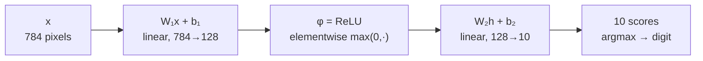
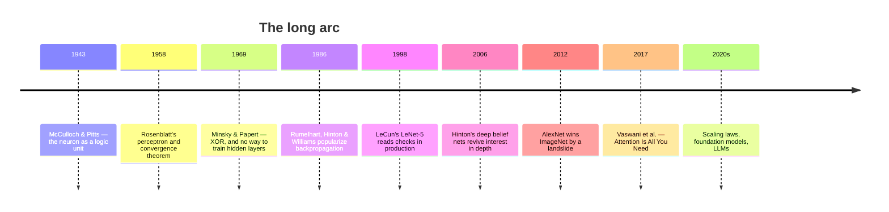

# 01 — What a neural network is

Every explanation of neural networks has to decide what to compare them to, and the choice does a lot of damage. The brain metaphor, which gave the field its name and its vocabulary, suggests that something mysterious and biological is happening. It is not. A neural network is a function. It takes numbers in and produces numbers out, it has adjustable knobs, and training is the process of turning those knobs until the outputs are the ones you wanted. Everything in the remaining fourteen modules is an elaboration of that sentence: which function, which knobs, how to turn them, and what structure to build into the function so the turning goes faster.

This module establishes that framing precisely, then walks the seventy-year history that produced it — not out of antiquarianism, but because the history is unusually instructive. The field died twice for identifiable technical reasons and revived twice for identifiable technical reasons, and understanding those reasons tells you a great deal about what is load-bearing and what is fashion.

> **Prerequisite:** none beyond comfort with programming and having seen a function of several variables. Module 02 supplies the mathematics; this module only gestures at it.

## A function with knobs

Start with the concrete object this book will keep returning to. You have a 28×28 grayscale image of a handwritten digit, and you want to know which of the ten digits it is. The image is 784 numbers between 0 and 1, one per pixel. The answer you want is one of ten categories. So you need a function from $\mathbb{R}^{784}$ to something that expresses a choice among ten options — conventionally ten numbers, where the largest one names the predicted digit.

The simplest such function is a matrix multiply. Take a matrix $W$ of shape $10 \times 784$ and a vector $\mathbf{b}$ of length 10, and define

$$f(\mathbf{x}) = W\mathbf{x} + \mathbf{b}$$

Each of the ten rows of $W$ is a 784-dimensional vector of weights that gets dotted with the image, producing a single score. Row 3 is, in effect, a template for "threeness": pixels it weights positively are pixels that being bright makes the image more likely to be a 3, and pixels it weights negatively argue against. The bias $\mathbf{b}$ shifts each score by a constant, which lets the model express that some digits are simply more common than others before looking at any pixel.

Now count the knobs. $W$ has $10 \times 784 = 7840$ entries and $\mathbf{b}$ has 10, so this function has 7850 adjustable numbers. Collect all of them into a single symbol $\theta$ — this book will use $\theta$ throughout to mean "all the parameters, whatever they happen to be for the model under discussion" — and write the function as $f(\mathbf{x}; \theta)$ to make the dependence explicit. The semicolon is doing real work there: $\mathbf{x}$ is the input that changes every time you call the function, and $\theta$ is the configuration that stays fixed during use and changes only during training.

That distinction is the whole idea. Ordinary programming means writing the function directly: you, the engineer, decide what the code does. Machine learning means specifying a *family* of functions parameterized by $\theta$, defining a measure of how badly a particular $\theta$ performs on data you have, and then searching for a $\theta$ that scores well. You still design — you choose the family, and choosing well is most of Modules 10 through 12 — but you do not write down the classification rule. You write down the space of possible rules and let an optimizer find one.

Trained on MNIST with the loss and optimizer of Modules 04 and 06, that 7850-parameter function reaches about **92% test accuracy**.[^m1-measured] Roughly nine out of ten unseen handwritten digits are classified correctly by a single matrix multiplication. That is a genuinely surprising amount of mileage from a linear function, and it sets the baseline that everything more sophisticated has to beat.

## Why one matrix is not enough

It is also, in a specific and important sense, a dead end. $W\mathbf{x} + \mathbf{b}$ is a *linear* function, and stacking linear functions gains you nothing: if $f_1(\mathbf{x}) = W_1\mathbf{x} + \mathbf{b}_1$ and $f_2(\mathbf{u}) = W_2\mathbf{u} + \mathbf{b}_2$, then

$$f_2(f_1(\mathbf{x})) = W_2(W_1\mathbf{x} + \mathbf{b}_1) + \mathbf{b}_2 = (W_2W_1)\mathbf{x} + (W_2\mathbf{b}_1 + \mathbf{b}_2)$$

which is just another single linear function with weight matrix $W_2W_1$ and bias $W_2\mathbf{b}_1 + \mathbf{b}_2$. Ten stacked linear layers have exactly the representational power of one. Depth, by itself, buys nothing at all.

The fix is a single character's worth of change and it is the reason the field exists. Insert a nonlinear function $\phi$, applied elementwise, between the layers:

$$f(\mathbf{x}) = W_2\,\phi(W_1\mathbf{x} + \mathbf{b}_1) + \mathbf{b}_2$$

The modern default for $\phi$ is the rectifier, $\mathrm{ReLU}(z) = \max(0, z)$, which does nothing more than clamp negative numbers to zero. That is almost embarrassingly simple, and yet the collapse argument above no longer applies: $W_2\phi(W_1\mathbf{x})$ cannot in general be rewritten as $W'\mathbf{x}$, because $\phi$ is not linear. The composition is now genuinely richer than either piece.

Add one hidden layer of 128 units in exactly that shape and the same MNIST task goes from 92% to about **97.7%**.[^m1-measured] The parameter count rises from 7,850 to roughly 101,000, but that is not the interesting part — the interesting part is that the error rate fell by more than two thirds because of one elementwise `max`. That is the empirical fact the rest of this book explains.

The intermediate vector $\mathbf{h} = \phi(W_1\mathbf{x} + \mathbf{b}_1)$ deserves a name and a moment's thought. It has 128 entries, and each one is a learned feature: some function of the pixels that the training process decided was worth computing. Nobody specified what those features should be. They are whatever turned out to be useful for separating digits, discovered by gradient descent. This is the pivot the field is really built on — the move from *engineering features by hand and running a simple classifier on them* to *learning the features and the classifier together, end to end, from raw input*. Everything called "deep learning" is downstream of that move.

## The perceptron, and the first winter

The historical thread starts in 1943, when Warren McCulloch and Walter Pitts described a mathematical model of a neuron: sum weighted inputs, compare to a threshold, output 1 or 0.[^m1-mcculloch] They were doing neuroscience, arguing that networks of such units could compute logical propositions, and they had no learning rule at all — the weights were set by hand.

The learning rule arrived in 1958 with Frank Rosenblatt's perceptron.[^m1-rosenblatt] The model is the McCulloch–Pitts unit, $\hat{y} = \mathrm{sign}(\mathbf{w}\cdot\mathbf{x} + b)$, and the rule for adjusting it is almost trivially simple: show it an example, and if it gets the answer right, change nothing; if it gets the answer wrong, nudge the weights toward the correct answer by adding or subtracting the input,

$$\mathbf{w} \leftarrow \mathbf{w} + \eta\,(y - \hat{y})\,\mathbf{x}$$

Rosenblatt proved the *perceptron convergence theorem*: if the data can be separated by a hyperplane, this procedure will find one in a finite number of steps. It was a real theorem about a real learning machine, and it was implemented in hardware — the Mark I Perceptron used a 20×20 grid of photocells and motor-driven potentiometers for weights. The press reaction was roughly what you would expect, and roughly what it is today.

The trouble is the antecedent of that theorem. *If* the data are linearly separable. In 1969 Marvin Minsky and Seymour Papert published *Perceptrons*, a careful mathematical analysis whose most memorable result concerns the exclusive-or function.[^m1-minsky] XOR takes two binary inputs and returns 1 when exactly one of them is 1:

| $x_1$ | $x_2$ | XOR |
|-------|-------|-----|
| 0 | 0 | 0 |
| 0 | 1 | 1 |
| 1 | 0 | 1 |
| 1 | 1 | 0 |

Try to separate the two 1s from the two 0s with a single straight line in the plane. You cannot — the positive cases sit on one diagonal and the negative cases on the other, and no line has both diagonals' endpoints on opposite sides. A single perceptron therefore cannot learn XOR, not because the learning rule is weak but because no setting of its weights represents the function. This is the same collapse argument from the previous section, stated for the smallest possible example.

What is usually forgotten is that Minsky and Papert knew perfectly well that a *multi-layer* perceptron could represent XOR. Their point was sharper and, at the time, correct: nobody knew how to train one. The perceptron rule needs to know the error at a unit, and for a hidden unit there is no target to compare against — you know the network's final answer was wrong, but not which hidden unit to blame. This is the **credit assignment problem**, and it is the central technical obstacle of the era. Funding contracted, researchers left, and the period through the mid-1980s is the first "AI winter."

## Backpropagation and the second act

The solution is to make the network differentiable and use the chain rule. Replace the hard threshold with a smooth S-shaped function — the logistic sigmoid $\sigma(z) = 1/(1 + e^{-z})$ — so the whole network becomes a differentiable function of its weights. Then the derivative of the loss with respect to any weight, however deep, is computable by propagating derivatives backwards from the output, and each weight's share of the blame falls out of the arithmetic.

The idea has a tangled provenance. Seppo Linnainmaa published the general algorithm for reverse-mode automatic differentiation in his 1970 master's thesis, Paul Werbos applied it to neural networks in his 1974 PhD thesis, and David Parker and Yann LeCun arrived at versions independently in the mid-1980s. But it was the 1986 *Nature* paper by David Rumelhart, Geoffrey Hinton, and Ronald Williams that made the field pay attention, largely because it demonstrated something nobody had seen before: hidden units that learned meaningful, interpretable internal representations without being told what to represent.[^m1-rumelhart] Module 05 derives this algorithm in full and has you implement it; it is the single most important mechanism in the book.

The late 1980s and 1990s produced genuinely impressive systems on this foundation. Yann LeCun's work at Bell Labs applied backpropagation to convolutional networks for handwritten digit recognition, and by 1998 LeNet-5 was reading a substantial fraction of the checks processed in the United States.[^m1-lecun] That is a deployed, commercially load-bearing neural network, twenty-five years before the current boom, and it is worth holding onto when someone tells you deep learning was invented in 2012.

And yet the field went quiet again. Networks deeper than a few layers trained badly or not at all — sigmoid activations squash gradients toward zero, and the effect compounds multiplicatively with depth, so early layers received essentially no learning signal. Sepp Hochreiter had identified this precisely in 1991 and it is the phenomenon Module 08 treats quantitatively. Meanwhile, support vector machines offered convex optimization, unique global optima, elegant theory, and comparable or better accuracy on the dataset sizes then available. Given a choice between a method that provably converges and one that requires arcane initialization tricks and might silently fail, most researchers made the sensible choice. Through the early 2000s, "neural network" in a paper title was close to a liability.

## Why it works now

The revival is usually dated to 2012 and the ImageNet result, but its causes accumulated over the preceding decade, and disentangling them is the most useful thing this history has to offer. Four things changed, and they changed together.

**Data.** In 2007 Fei-Fei Li began building ImageNet, and by 2009 it contained over 14 million hand-labeled images across 20,000-plus categories.[^m1-imagenet] The competition subset alone — 1.2 million training images, 1,000 classes — was orders of magnitude larger than the datasets on which SVMs had beaten neural networks. This matters enormously, because the trade is asymmetric: a high-capacity model with millions of parameters overfits badly on small data and wins decisively on large data. The 1990s comparison was run in the regime where neural networks lose. Nobody was wrong; the regime changed.

**Compute.** Training is dominated by dense matrix multiplication, which is exactly what graphics hardware was built for. GPUs delivered one to two orders of magnitude more arithmetic throughput per dollar than CPUs, and by the late 2000s they were programmable enough to use. Experiments that would have taken months became overnight jobs, and the rate at which researchers can run experiments turns out to be the rate at which the field progresses.

**Algorithms.** A cluster of specific fixes removed the failure modes that had made deep networks untrainable. ReLU replaced sigmoid and largely dissolved the vanishing gradient problem in feedforward nets (Module 03). Principled initialization schemes from Glorot and Bengio, later refined by He, kept activations from exploding or dying as they propagate through depth (Module 08). Dropout gave a cheap and effective regularizer for large models (Module 07). Batch normalization made deep networks dramatically more forgiving of hyperparameter choices (Module 08). Adam made optimization work acceptably without heroic learning-rate tuning (Module 06). Residual connections made networks of hundreds of layers trainable at all (Module 10). Not one of these is conceptually deep. Together they are the difference between a method that fails mysteriously and one that works reliably.

**Software.** Theano, then Caffe and TensorFlow, then PyTorch turned building a network from a research project into an afternoon. Automatic differentiation in particular — Module 05's subject — means you write only the forward computation and the framework derives the gradients. It is difficult to overstate how much this accelerated everything.

The moment those four converged is AlexNet.[^m1-alexnet] In the 2012 ImageNet competition, Krizhevsky, Sutskever, and Hinton's eight-layer convolutional network trained on two GPUs achieved 15.3% top-5 error against 26.2% for the runner-up — not a marginal improvement but a rout, in a competition where the previous year's progress had been measured in fractions of a point. Within two years essentially every entrant was a deep network. Module 10 dissects AlexNet's architecture in detail; for now, note that it is LeNet's ideas, scaled up by the four factors above and stabilized by ReLU and dropout.

## What a network is, stated properly

With the history in place, here is the definition the rest of the book uses. A neural network is a function $f(\mathbf{x}; \theta)$ built by composing simple parameterized transformations — typically alternating affine maps $W\mathbf{x} + \mathbf{b}$ with fixed elementwise nonlinearities — chosen so that the whole composition is differentiable with respect to $\theta$ almost everywhere. Training means defining a loss $\mathcal{L}(f(\mathbf{x};\theta), y)$ that measures disagreement with the desired output, averaging it over a dataset to get an objective $J(\theta)$, and using the gradient $\nabla_\theta J$ to iteratively decrease it.

Three things in that definition are worth pausing on. The requirement is *differentiability*, not any resemblance to biology — real neurons spike, do not obviously implement backpropagation, and are not the reason any of this works. The parameters are found by *local search*, so the objective landscape's shape matters and there is no guarantee of finding the global optimum, which turns out empirically to matter far less than theory once feared (Module 06). And the goal is performance on data the model has *never seen*, not on the training set, which is why Module 07 exists and why "the loss went down" is not the same claim as "the model is good."

Notice also what this definition leaves entirely open: the choice of which transformations to compose. Plain alternating affine-and-nonlinear layers, the multilayer perceptron of Module 03, treats every input coordinate as unrelated to every other. But a pixel is strongly related to its neighbors, a word is strongly related to the words around it, and building those facts into the function class rather than forcing the optimizer to rediscover them is what convolution (Module 10), recurrence (Module 11), and attention (Module 12) each do. Architecture is applied prior knowledge. That is the through-line of the book's second half.

## Before you move on

The idea to carry forward is that a neural network is a parameterized function found by optimization rather than written by hand, that composing linear maps alone is pointless because they collapse, and that the elementwise nonlinearity between layers is precisely what makes depth mean anything. The history is not decoration: the perceptron's failure on XOR is the collapse argument in miniature, the first winter ended when backpropagation solved credit assignment, the second ended when data, compute, algorithmic fixes, and software arrived together, and knowing which of those four is missing is often how you diagnose why something is not working today.

If you can explain to someone why ten stacked linear layers are no more expressive than one, why a single perceptron cannot learn XOR and what exactly Minsky and Papert were right about, and why the same neural network methods that lost to support vector machines in 1998 won decisively in 2012, then you have what this module was for. If any of those feels shaky, reread the corresponding section before continuing — the collapse argument in particular gets used again in Modules 03 and 08. [Exercise Set 01](./exercises/01-exercises.md) makes the collapse argument concrete by having you train a deep linear network and watch it plateau exactly where a single linear layer does.

Next, [Module 02](./02-mathematical-foundations.md) builds the mathematical vocabulary: the matrix conventions, the gradient notation, and the probability facts that Modules 04 and 05 depend on. If you are already fluent with Jacobians and log-likelihoods you can skim it, but do read the section on the transpose convention, because the mismatch between textbook math and PyTorch's actual layout confuses nearly everyone once.

## Sources

[^m1-measured]: Measured while writing this module: `nn.Linear(784, 10)` and a `784→128→ReLU→10` MLP, both trained 10 epochs with SGD at learning rate 0.1, batch size 64, on the standard MNIST split — 92.35% and 97.70% test accuracy respectively. Your numbers will differ by up to about a percentage point depending on seed, device and library version — a repeat run on GPU gave 91.58% and 97.90% — but the size of the gap is stable, which is the part that matters. The reference implementation is in the [Module 01 solutions](./exercises/solutions/01-solutions.md).

[^m1-mcculloch]: Warren McCulloch and Walter Pitts, ["A Logical Calculus of the Ideas Immanent in Nervous Activity"](https://link.springer.com/article/10.1007/BF02478259), *Bulletin of Mathematical Biophysics* 5, 1943. Establishes the threshold-unit model of a neuron; note that it contains no learning rule.

[^m1-rosenblatt]: Frank Rosenblatt, ["The Perceptron: A Probabilistic Model for Information Storage and Organization in the Brain"](https://psycnet.apa.org/record/1959-09865-001), *Psychological Review* 65(6), 1958. The learning rule and the convergence theorem.

[^m1-minsky]: Marvin Minsky and Seymour Papert, *Perceptrons: An Introduction to Computational Geometry*, MIT Press, 1969. Source of the XOR limitation; see the [MIT Press page](https://mitpress.mit.edu/9780262534772/perceptrons/) for the expanded edition. The credit-assignment obstacle for multi-layer networks is their sharper and more consequential point.

[^m1-rumelhart]: David Rumelhart, Geoffrey Hinton and Ronald Williams, ["Learning representations by back-propagating errors"](https://www.nature.com/articles/323533a0), *Nature* 323, 1986. The paper that made backpropagation known to the field; the emphasis on learned internal representations is the part that mattered.

[^m1-lecun]: Yann LeCun, Léon Bottou, Yoshua Bengio and Patrick Haffner, ["Gradient-Based Learning Applied to Document Recognition"](http://yann.lecun.com/exdb/publis/pdf/lecun-98.pdf), *Proceedings of the IEEE* 86(11), 1998. LeNet-5, and the source of MNIST itself. Dissected in Module 10.

[^m1-imagenet]: Jia Deng et al., ["ImageNet: A Large-Scale Hierarchical Image Database"](https://www.image-net.org/static_files/papers/imagenet_cvpr09.pdf), CVPR 2009. Scale figures for the dataset are from this paper and the [ImageNet site](https://www.image-net.org/).

[^m1-alexnet]: Alex Krizhevsky, Ilya Sutskever and Geoffrey Hinton, ["ImageNet Classification with Deep Convolutional Neural Networks"](https://papers.nips.cc/paper_files/paper/2012/hash/c399862d3b9d6b76c8436e924a68c45b-Abstract.html), NeurIPS 2012. The 15.3% vs 26.2% top-5 error comparison is from Section 6.

**Further reading.** Goodfellow, Bengio and Courville, *Deep Learning*, [Chapter 1](https://www.deeplearningbook.org/contents/intro.html), gives a longer and excellent version of this history, including the shifting names the field has gone by. *Dive into Deep Learning*, [Chapter 1](https://d2l.ai/chapter_introduction/index.html), covers the same ground with more emphasis on the modern practice. For the perceptron in code and the linear-classifier baseline, the [CS231n linear classification notes](https://cs231n.github.io/linear-classify/) are the clearest short treatment available.
