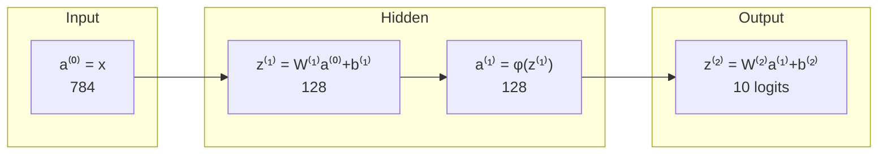

# 03 — Feedforward networks, activations, and what depth buys you

Module 01 established that a nonlinearity between linear layers is what makes depth meaningful, and Module 02 supplied the notation. This module builds the resulting object properly: the multilayer perceptron, the plainest and most fundamental neural architecture, and the one every later architecture is a specialization of. Along the way we settle the question of which nonlinearity to use and why, solve XOR by hand to see a hidden layer actually doing its job, and then confront the universal approximation theorem — a result that is quoted constantly, usually to justify conclusions it does not support.

> **Prerequisite:** [Module 02](./02-mathematical-foundations.md) — matrix–vector notation, shapes, and the derivative table.

## The multilayer perceptron

A feedforward network, equivalently a multilayer perceptron or MLP, is defined by a recursion. Start with the input, $\mathbf{a}^{(0)} = \mathbf{x}$. Then for each layer $\ell = 1, \dots, L$:

$$\mathbf{z}^{(\ell)} = W^{(\ell)}\mathbf{a}^{(\ell-1)} + \mathbf{b}^{(\ell)}, \qquad \mathbf{a}^{(\ell)} = \phi\!\left(\mathbf{z}^{(\ell)}\right)$$

and take the network's output to be $\mathbf{a}^{(L)}$, usually with the final $\phi$ omitted so that the last layer emits raw logits. The word "feedforward" names the constraint that makes this a clean recursion: information flows strictly from input toward output with no cycles, so the computation is a directed acyclic graph. Module 11's recurrent networks break exactly this rule, and that is what makes them harder to train.

Each layer's shape is fully determined by the dimensions on either side of it. If layer $\ell$ has $n_\ell$ units and layer $\ell-1$ has $n_{\ell-1}$, then $W^{(\ell)} \in \mathbb{R}^{n_\ell \times n_{\ell-1}}$ and $\mathbf{b}^{(\ell)} \in \mathbb{R}^{n_\ell}$, contributing $n_\ell n_{\ell-1} + n_\ell$ parameters. For the running MNIST MLP with layer sizes 784 → 128 → 10, that is $784 \times 128 + 128 = 100{,}480$ parameters in the first layer and $128 \times 10 + 10 = 1{,}290$ in the second, for **101,770** total.[^m3-count] Almost 99% of the parameters live in the first layer, which is a direct consequence of the input being high-dimensional and is the structural inefficiency that convolution fixes in Module 10.



The term "hidden layer" simply means a layer whose values are not observed in the training data — you are given inputs and targets, and everything in between is the network's own business. Depth is conventionally counted as the number of weight matrices, so a network with one hidden layer is a two-layer network. This is an endless source of off-by-one arguments in conversation; when it matters, name the layer sizes.

Two design decisions are forced by the problem rather than chosen. The input dimension is whatever your data is: 784 for flattened MNIST. The output dimension and final activation are determined by the task — one unit with no activation for scalar regression, one unit with a sigmoid for binary classification, $K$ units feeding a softmax for $K$-way classification. Everything else, the number of hidden layers and their widths, is yours to choose, and Modules 07 and 09 are about choosing well.

In PyTorch the recursion above is written almost literally:

```python
import torch.nn as nn

model = nn.Sequential(
    nn.Flatten(),          # (B, 1, 28, 28) -> (B, 784)
    nn.Linear(784, 128),   # W⁽¹⁾, b⁽¹⁾
    nn.ReLU(),             # φ
    nn.Linear(128, 10),    # W⁽²⁾, b⁽²⁾  -> logits, no final activation
)
print(sum(p.numel() for p in model.parameters()))   # 101770
```

`nn.Sequential` is the composition operator. Note the absence of a softmax at the end: the loss function will apply it, for numerical reasons Module 04 explains.

## XOR, worked by hand

Before trusting the machinery, it is worth watching a hidden layer solve the exact problem that killed the perceptron. Recall from Module 01 that XOR is not linearly separable — no single line separates $\{(0,1),(1,0)\}$ from $\{(0,0),(1,1)\}$. Here is a two-unit hidden layer that solves it, with weights written down rather than learned.[^m3-xor]

$$W^{(1)} = \begin{bmatrix}1 & 1\\ 1 & 1\end{bmatrix},\quad \mathbf{b}^{(1)} = \begin{bmatrix}0\\ -1\end{bmatrix},\quad \mathbf{w}^{(2)} = \begin{bmatrix}1 & -2\end{bmatrix},\quad b^{(2)} = 0$$

with ReLU as the hidden activation. Both hidden units compute the same quantity $x_1 + x_2$, differing only in their bias, so the first fires whenever the sum is positive and the second fires only when the sum exceeds 1. Trace all four inputs:

| $\mathbf{x}$ | $x_1+x_2$ | $h_1 = \mathrm{ReLU}(x_1{+}x_2)$ | $h_2 = \mathrm{ReLU}(x_1{+}x_2-1)$ | $y = h_1 - 2h_2$ | XOR |
|---|---|---|---|---|---|
| (0,0) | 0 | 0 | 0 | 0 | 0 |
| (0,1) | 1 | 1 | 0 | 1 | 1 |
| (1,0) | 1 | 1 | 0 | 1 | 1 |
| (1,1) | 2 | 2 | 1 | $2-2=0$ | 0 |

Exactly right on all four. The mechanism is worth staring at, because it is the mechanism of every neural network. The two inputs $(0,1)$ and $(1,0)$ are distinct in the input space but map to the *same* hidden representation $(1, 0)$ — the layer has learned to ignore a distinction that does not matter. Meanwhile $(0,0)$ and $(1,1)$, which need the same output, are mapped to *different* hidden points $(0,0)$ and $(2,1)$, and the output layer handles them with a linear rule anyway because the second unit's activation subtracts off the excess. In the hidden space, the problem has become linearly separable. That is what a hidden layer is for: **learn a representation in which the problem is easy, then solve the easy problem linearly.** Every deep network is this move, repeated.

Notice too that the nonlinearity is doing all the work. Without ReLU, both hidden units would be affine functions of $x_1 + x_2$, the output would be an affine function of $x_1 + x_2$, and no choice of $\mathbf{w}^{(2)}$ could produce a non-monotonic response. The `max(0, ·)` is the entire difference between possible and impossible.

## Choosing an activation function

The nonlinearity has to satisfy remarkably few requirements — it must be nonlinear, and it must be differentiable enough to backpropagate through — so the field has accumulated a menagerie. The useful way to organize them is historically, as a sequence of fixes for specific defects.

**Sigmoid**, $\sigma(z) = 1/(1+e^{-z})$, squashes any real number into $(0,1)$ and was the default for decades because of its biological analogy and its probabilistic reading. It has two serious defects for hidden layers. Its derivative $\sigma(z)(1-\sigma(z))$ peaks at 0.25 and decays to essentially zero once $|z|$ exceeds about 5, so a saturated unit passes almost no gradient and effectively stops learning — and since the best case is a factor of 0.25 per layer, gradients shrink by at least $4^{-L}$ through $L$ layers, which is the vanishing gradient problem quantified. Its outputs are also never negative, which means all gradients flowing into a given unit's weights share a sign and updates zigzag rather than moving diagonally. Sigmoid survives today only as an *output* activation for binary classification and inside LSTM gates (Module 11), where its $(0,1)$ range is being used deliberately as a soft switch.

**Tanh**, $\tanh(z) = 2\sigma(2z) - 1$, is a rescaled sigmoid with range $(-1,1)$ and derivative $1 - \tanh^2(z)$ peaking at 1. Being zero-centered fixes the zigzag problem and the larger maximum derivative helps, so tanh is strictly better than sigmoid for hidden layers — but it still saturates, so the vanishing gradient problem is delayed rather than solved. It remains the standard choice inside RNN cells.

**ReLU**, $\mathrm{ReLU}(z) = \max(0, z)$, is the modern default and its dominance is not an accident.[^m3-relu] Its derivative is exactly 1 for all positive inputs, so gradients pass through the active region completely undiminished no matter how deep the stack — a chain of fifty ReLU layers multiplies the gradient by 1, not by $0.25^{50}$. It is trivially cheap to compute, a comparison and a select rather than an exponential. And it produces genuinely sparse activations, since roughly half the units output exactly zero for a given input, which appears to help. AlexNet's authors reported that ReLU let their network reach a given training error roughly six times faster than the tanh equivalent, and that speedup was a material part of why the 2012 result was possible.

ReLU has one real failure mode, called the **dying ReLU**. Because the gradient is exactly zero for negative inputs, a unit whose pre-activation is negative for every training example receives zero gradient forever and never recovers — it is permanently dead, contributing nothing. This typically happens after a too-large gradient step pushes the bias sharply negative, which is one concrete reason Module 06 cares about learning rates.

The fixes for dying ReLU are all variations on giving the negative region a nonzero slope. **Leaky ReLU** uses $\max(\alpha z, z)$ with $\alpha$ around 0.01, so dead units still receive a trickle of gradient. **ELU** and **SELU** use a smooth exponential curve on the negative side. **GELU**, $z \cdot \Phi(z)$ where $\Phi$ is the Gaussian CDF, is smooth everywhere and is the standard choice in Transformers — BERT and the GPT family all use it — and **SiLU/Swish**, $z\sigma(z)$, is closely related and common in modern vision models.[^m3-gelu] Empirically these give modest and inconsistent gains over ReLU on typical feedforward problems, which is why ReLU remains a perfectly defensible default, but in Transformer blocks the smooth variants are the convention and you should follow it.

| Activation | Formula | Range | Derivative at 0⁺ | Use it for |
|---|---|---|---|---|
| Sigmoid | $1/(1+e^{-z})$ | $(0,1)$ | 0.25 | binary output; LSTM gates |
| Tanh | $(e^z-e^{-z})/(e^z+e^{-z})$ | $(-1,1)$ | 1 | RNN hidden states |
| ReLU | $\max(0,z)$ | $[0,\infty)$ | 1 | default for MLPs and CNNs |
| Leaky ReLU | $\max(\alpha z, z)$ | $(-\infty,\infty)$ | 1 | when you suspect dying units |
| GELU | $z\,\Phi(z)$ | $\approx(-0.17,\infty)$ | 0.5 | Transformers |
| SiLU/Swish | $z\,\sigma(z)$ | $\approx(-0.28,\infty)$ | 0.5 | modern CNNs |

The practical advice is short. Use ReLU unless you have a reason not to. Use GELU in Transformers because that is what the architecture was tuned with. Never use sigmoid or tanh in the hidden layers of a deep feedforward network. And if a large fraction of your units are outputting zero for every input — a diagnostic Module 09 shows you how to run — switch to Leaky ReLU and lower your learning rate.

**Softmax is not in this table on purpose.** It converts a vector of $K$ logits into a probability distribution,

$$\mathrm{softmax}(\mathbf{z})_i = \frac{e^{z_i}}{\sum_{j=1}^{K} e^{z_j}}$$

and unlike every activation above it is *not* elementwise — every output depends on every input, because of the normalizing sum. It belongs at the output of a classifier, never between hidden layers, and in PyTorch you generally do not write it at all because the loss applies it internally. Module 04 explains why that matters numerically.

## Universal approximation: what it actually says

The most-cited theorem in the field is also the most-abused, so it is worth stating carefully. In 1989 George Cybenko proved that a feedforward network with a **single hidden layer** using sigmoidal activations can approximate any continuous function on a compact subset of $\mathbb{R}^n$ to arbitrary accuracy, provided the hidden layer is allowed to be wide enough.[^m3-cybenko] Kurt Hornik generalized this two years later, showing the result depends on the *architecture* rather than the specific activation — any non-polynomial activation works.[^m3-hornik] Formally: for any continuous $f$ on compact $K$ and any $\epsilon > 0$, there exists a width $N$ and parameters such that $\sup_{\mathbf{x}\in K}|f(\mathbf{x}) - \hat{f}(\mathbf{x})| < \epsilon$.

That is a genuinely strong statement about representational power, and it settles the question Minsky and Papert raised: multilayer networks are not limited in what they can express. But notice the four things it does not say, because the gap between the theorem and the practice is where all the actual difficulty lives.

It says nothing about **how wide** $N$ must be. For many functions the required width grows exponentially in the input dimension, which for a 784-dimensional input is not a number you can build. The theorem guarantees existence, not tractability.

It says nothing about **finding** the parameters. It asserts that a good $\theta$ exists somewhere in parameter space; it offers no guarantee that gradient descent from a random initialization will reach it, and no bound on how long that would take. Representation and optimization are different problems, and Module 06 is about the second one.

It says nothing about **generalization**. Approximating a function well on the training data is not the same as approximating the true underlying function, and a network with enough capacity to fit anything can and will fit noise. That is Module 07's entire subject.

And it says nothing about **depth being useless**. This is the inference people most often draw and it is backwards. The theorem says one hidden layer *suffices in principle*; it says nothing about efficiency. A substantial body of later work shows that depth is exponentially more parameter-efficient for many function families — Montúfar and colleagues showed that the number of linear regions a ReLU network can carve out of its input space grows exponentially with depth but only polynomially with width, and Telgarsky exhibited functions computable by a deep network with $\Theta(k^3)$ layers that require $\Omega(2^k)$ units in any network of $O(k)$ layers.[^m3-montufar] The practical reading is that depth lets you compose features hierarchically — edges into shapes into objects — and a shallow network must enumerate what a deep one can build compositionally.

So the honest summary is that universal approximation tells you the function class is rich enough that expressiveness is not your problem. Your problems will be optimization and generalization, in that order, and neither is addressed by this theorem.

## How wide, how deep?

Given all that, what do you actually choose? Start with something known to work on a similar problem rather than reasoning from scratch — this is the single most efficient strategy and it is what practitioners actually do. For MNIST, one or two hidden layers of 128 to 512 units is well past sufficient; the user log for this repository's earlier MNIST project found that a second hidden layer added essentially nothing, because a single-hidden-layer MLP already saturates the task at around 98%.

The general shape of the tradeoff is that wider layers add capacity within a level of abstraction while deeper stacks add levels of abstraction, and for problems with genuine compositional structure — vision, language — depth wins decisively. Widths are conventionally powers of two, purely for hardware alignment, and the classic pattern is a funnel that narrows toward the output, though modern architectures often keep width constant across blocks instead. It is worth knowing that both capacity dials interact strongly with regularization: a bigger network that is properly regularized frequently beats a smaller unregularized one, which is why "make it big enough to overfit, then regularize" is the standard recipe of Module 09 rather than "find the perfect size."

One structural point to carry into Module 10. An MLP applied to an image treats the 784 pixels as an unordered bag of numbers — permute all the pixels consistently across the entire dataset and the MLP learns exactly as well, because nothing in $W\mathbf{x}$ knows that pixel 5 is adjacent to pixel 6. That is an enormous piece of discarded information, and it is why an MLP tops out near 98% on MNIST while a convolutional network, which builds adjacency into the function class, reaches 99%+ with fewer parameters. Architecture is applied prior knowledge, and the MLP's prior is that there is no structure at all.

## Before you move on

The MLP is the recursion $\mathbf{z}^{(\ell)} = W^{(\ell)}\mathbf{a}^{(\ell-1)}+\mathbf{b}^{(\ell)}$, $\mathbf{a}^{(\ell)} = \phi(\mathbf{z}^{(\ell)})$, and its hidden layers exist to transform the input into a representation where the problem is linearly separable — which the XOR construction shows concretely, by collapsing two inputs that need the same answer onto the same hidden point. ReLU is the default activation because its derivative is exactly one on the active region, which is what lets gradients survive depth, and its one real failure mode is units that die by going permanently negative. Universal approximation guarantees that expressiveness will not be your bottleneck, and guarantees nothing about width, optimization, or generalization, all of which will be.

If you can construct the XOR solution from memory and explain why $(0,1)$ and $(1,0)$ landing on the same hidden vector is the point rather than a coincidence, argue for ReLU over sigmoid with the derivative arithmetic rather than by assertion, and state three things universal approximation does not promise, then this module has done its job. [Exercise Set 03](./exercises/03-exercises.md) has you build the XOR network by hand, then compare activation functions on a network deep enough for the difference to matter.

Next, [Module 04](./04-loss-functions-and-the-probabilistic-view.md) supplies the missing half of the training setup. You now have a function; you need a principled way to say how wrong it is, and the answer turns out to fall out of maximum likelihood almost mechanically.

## Sources

[^m3-count]: Verified while writing: `nn.Sequential(nn.Flatten(), nn.Linear(784,128), nn.ReLU(), nn.Linear(128,10))` reports 101,770 parameters via `sum(p.numel() for p in model.parameters())`, decomposing as 100,480 + 1,290.

[^m3-xor]: This construction is Goodfellow, Bengio and Courville, *Deep Learning*, [Section 6.1](https://www.deeplearningbook.org/contents/mlp.html), where it is used for exactly the same pedagogical purpose. The forward pass in the table was verified numerically in PyTorch while writing this module.

[^m3-relu]: Xavier Glorot, Antoine Bordes and Yoshua Bengio, ["Deep Sparse Rectifier Neural Networks"](https://proceedings.mlr.press/v15/glorot11a.html), AISTATS 2011, is the paper that made the case for ReLU in deep networks. The six-times-faster convergence figure is from Krizhevsky, Sutskever and Hinton, ["ImageNet Classification with Deep Convolutional Neural Networks"](https://papers.nips.cc/paper_files/paper/2012/hash/c399862d3b9d6b76c8436e924a68c45b-Abstract.html), NeurIPS 2012, Section 3.1 — note it is a training-error-threshold comparison on CIFAR-10, not a general law.

[^m3-gelu]: Dan Hendrycks and Kevin Gimpel, ["Gaussian Error Linear Units (GELUs)"](https://arxiv.org/abs/1606.08415), 2016; and Prajit Ramachandran, Barret Zoph and Quoc Le, ["Searching for Activation Functions"](https://arxiv.org/abs/1710.05941), 2017, which introduced Swish/SiLU. The reported gains over ReLU are consistently small and task-dependent; treat the choice as convention-following rather than principled.

[^m3-cybenko]: George Cybenko, ["Approximation by Superpositions of a Sigmoidal Function"](https://link.springer.com/article/10.1007/BF02551274), *Mathematics of Control, Signals and Systems* 2, 1989. The single-hidden-layer result for sigmoidal activations.

[^m3-hornik]: Kurt Hornik, ["Approximation Capabilities of Multilayer Feedforward Networks"](https://www.sciencedirect.com/science/article/abs/pii/089360809190009T), *Neural Networks* 4(2), 1991. Shows the property belongs to the architecture rather than the choice of activation.

[^m3-montufar]: Guido Montúfar, Razvan Pascanu, Kyunghyun Cho and Yoshua Bengio, ["On the Number of Linear Regions of Deep Neural Networks"](https://arxiv.org/abs/1402.1869), NeurIPS 2014; and Matus Telgarsky, ["Benefits of Depth in Neural Networks"](https://arxiv.org/abs/1602.04485), COLT 2016. Together these are the standard citations for depth being exponentially more efficient than width.

**Further reading.** *Deep Learning* [Chapter 6](https://www.deeplearningbook.org/contents/mlp.html) is the definitive treatment of feedforward networks and covers the XOR example, activation choices, and architecture design at more length. *Dive into Deep Learning* [Chapter 5](https://d2l.ai/chapter_multilayer-perceptrons/index.html) covers the same material with runnable code and is the better companion while experimenting. The [CS231n neural networks notes, part 1](https://cs231n.github.io/neural-networks-1/) contain the clearest practical discussion of activation function tradeoffs available anywhere, including the dying ReLU phenomenon. Michael Nielsen's [visual proof of universal approximation](http://neuralnetworksanddeeplearning.com/chap4.html) is genuinely worth an hour if you want to *see* why the theorem is true rather than take it on faith.
