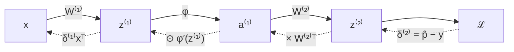

# 05 — Backpropagation and automatic differentiation

This is the module that makes everything else stop feeling like superstition. You have a function with a hundred thousand parameters and a scalar that measures its wrongness; you need the derivative of that scalar with respect to every one of those parameters, and you need it fast enough to do it a million times. Backpropagation is the algorithm that delivers exactly this, at a cost of roughly two forward passes, regardless of how many parameters there are. It is the mechanism that solved the credit assignment problem that stalled the field for seventeen years, and it is the single idea most worth understanding completely rather than approximately.

We will do this three times, deliberately. First by hand on a two-layer network, where you can see every term. Then as a general algorithm on computational graphs. Then in code — a working automatic differentiation engine in about sixty lines, followed by the PyTorch machinery it is a miniature of. Do not skip the hand derivation. Reading backpropagation is not the same as doing it, and the difference shows up later as a persistent vagueness about what `loss.backward()` is actually doing.

> **Prerequisite:** [Module 04](./04-loss-functions-and-the-probabilistic-view.md) — you need the cross-entropy loss and its logit gradient $\hat{\mathbf{p}} - \mathbf{y}$, plus the multivariable chain rule from [Module 02](./02-mathematical-foundations.md).

## The naive approach, and why it fails

Before the clever algorithm, understand the obvious one. You could estimate every partial derivative numerically by finite differences:

$$\frac{\partial J}{\partial \theta_i} \approx \frac{J(\theta + \epsilon\mathbf{e}_i) - J(\theta - \epsilon\mathbf{e}_i)}{2\epsilon}$$

Perturb one parameter, recompute the loss, take the difference. This is correct, trivially implementable, and completely unusable: each partial derivative requires two full forward passes, so a full gradient costs $2P$ forward passes for $P$ parameters. For the 101,770-parameter MNIST MLP that is over 200,000 forward passes per gradient step. For a model with a billion parameters it is not a slow algorithm, it is a physically impossible one.

Backpropagation computes the *entire* gradient — all $P$ partials — in a single backward sweep costing about the same as one forward pass. That improvement, from $O(P)$ forward passes to $O(1)$, is what makes deep learning exist. Keep the finite-difference formula in mind, though, because it remains the gold standard for *checking* an analytic gradient, and you will use it for exactly that at the end of this module.

## Backpropagation by hand

Take the running MNIST classifier: one hidden layer with ReLU, a softmax output, cross-entropy loss. Work with a single example first; the batch version follows mechanically. The forward pass is

$$\mathbf{z}^{(1)} = W^{(1)}\mathbf{x} + \mathbf{b}^{(1)}, \quad \mathbf{a}^{(1)} = \mathrm{ReLU}(\mathbf{z}^{(1)}), \quad \mathbf{z}^{(2)} = W^{(2)}\mathbf{a}^{(1)} + \mathbf{b}^{(2)}, \quad \hat{\mathbf{p}} = \mathrm{softmax}(\mathbf{z}^{(2)}), \quad \mathcal{L} = -\log\hat{p}_y$$

We want $\partial\mathcal{L}/\partial W^{(1)}$, $\partial\mathcal{L}/\partial\mathbf{b}^{(1)}$, $\partial\mathcal{L}/\partial W^{(2)}$, $\partial\mathcal{L}/\partial\mathbf{b}^{(2)}$. The organizing trick — and it is the whole trick — is to define an intermediate quantity for each layer, conventionally called delta, that holds the gradient of the loss with respect to that layer's *pre-activation*:

$$\boldsymbol{\delta}^{(\ell)} \equiv \frac{\partial\mathcal{L}}{\partial\mathbf{z}^{(\ell)}}$$

Once you have $\boldsymbol{\delta}^{(\ell)}$, the parameter gradients for that layer are immediate, and you can compute $\boldsymbol{\delta}^{(\ell-1)}$ from it. So the algorithm becomes: get delta at the top, then walk down.

**Step 1 — delta at the output.** Module 04 already did this work. The gradient of softmax cross-entropy with respect to the logits is

$$\boldsymbol{\delta}^{(2)} = \frac{\partial\mathcal{L}}{\partial\mathbf{z}^{(2)}} = \hat{\mathbf{p}} - \mathbf{y}$$

where $\mathbf{y}$ is the one-hot target. Prediction minus truth. If the model assigns 0.7 to the correct class, that component of delta is $-0.3$; a class it wrongly gave 0.2 has component $+0.2$. The sign says which direction each logit should move, and the magnitude says how urgently.

**Step 2 — parameters of the output layer.** Since $z^{(2)}_i = \sum_j W^{(2)}_{ij}a^{(1)}_j + b^{(2)}_i$, the partial of $z^{(2)}_i$ with respect to $W^{(2)}_{ij}$ is simply $a^{(1)}_j$, and $W^{(2)}_{ij}$ influences the loss through $z^{(2)}_i$ and nothing else. So

$$\frac{\partial\mathcal{L}}{\partial W^{(2)}_{ij}} = \delta^{(2)}_i a^{(1)}_j \quad\Longleftrightarrow\quad \frac{\partial\mathcal{L}}{\partial W^{(2)}} = \boldsymbol{\delta}^{(2)}\big(\mathbf{a}^{(1)}\big)^\top$$

an outer product of the delta with the incoming activation. That form has a memorable reading: **the gradient of a weight is (how wrong the output was) times (how active the input was).** A weight is blamed in proportion to both. If the input was zero, the weight had no effect on this example and receives no gradient. For the bias, $\partial z^{(2)}_i/\partial b^{(2)}_i = 1$, so $\partial\mathcal{L}/\partial\mathbf{b}^{(2)} = \boldsymbol{\delta}^{(2)}$ exactly.

**Step 3 — push delta backwards through the linear layer.** The hidden activation $a^{(1)}_j$ influences the loss through *every* output logit, so the multivariable chain rule sums over those paths:

$$\frac{\partial\mathcal{L}}{\partial a^{(1)}_j} = \sum_i \frac{\partial\mathcal{L}}{\partial z^{(2)}_i}\frac{\partial z^{(2)}_i}{\partial a^{(1)}_j} = \sum_i \delta^{(2)}_i W^{(2)}_{ij} \quad\Longleftrightarrow\quad \frac{\partial\mathcal{L}}{\partial\mathbf{a}^{(1)}} = \big(W^{(2)}\big)^\top\boldsymbol{\delta}^{(2)}$$

The transpose is not a technicality — it is the mathematical statement that **the backward pass sends signal through the same weights as the forward pass, in reverse**. Forward, $W$ maps hidden units to logits; backward, $W^\top$ maps logit-gradients to hidden-unit-gradients. Every unit's blame is the weighted sum of the blames of everything it fed into, weighted by exactly the connection strengths it used.

**Step 4 — push delta through the activation.** ReLU is elementwise, so each $a^{(1)}_j$ depends only on $z^{(1)}_j$, and the chain rule is a plain product with no summation:

$$\boldsymbol{\delta}^{(1)} = \frac{\partial\mathcal{L}}{\partial\mathbf{a}^{(1)}}\odot\mathrm{ReLU}'\big(\mathbf{z}^{(1)}\big) = \Big(\big(W^{(2)}\big)^\top\boldsymbol{\delta}^{(2)}\Big)\odot\mathbb{1}\big[\mathbf{z}^{(1)}>0\big]$$

where $\odot$ is elementwise multiplication and $\mathbb{1}[\cdot]$ is 1 where the condition holds and 0 elsewhere. This is where dying ReLUs come from, visibly: any unit whose pre-activation was negative multiplies its incoming gradient by zero, and its weights get no update from this example.

**Step 5 — parameters of the first layer.** Identical in form to step 2, one level down:

$$\frac{\partial\mathcal{L}}{\partial W^{(1)}} = \boldsymbol{\delta}^{(1)}\mathbf{x}^\top, \qquad \frac{\partial\mathcal{L}}{\partial\mathbf{b}^{(1)}} = \boldsymbol{\delta}^{(1)}$$

Done. Every gradient in the network, obtained by one sweep downward.

## The general recursion

Steps 3 and 4 did not use anything specific to this network, so they generalize immediately. For any feedforward stack of affine-then-elementwise-nonlinearity layers, the four equations of backpropagation are:

$$\boxed{\;\boldsymbol{\delta}^{(L)} = \nabla_{\mathbf{a}^{(L)}}\mathcal{L}\odot\phi'\big(\mathbf{z}^{(L)}\big)\;}$$
$$\boxed{\;\boldsymbol{\delta}^{(\ell)} = \Big(\big(W^{(\ell+1)}\big)^\top\boldsymbol{\delta}^{(\ell+1)}\Big)\odot\phi'\big(\mathbf{z}^{(\ell)}\big)\;}$$
$$\boxed{\;\frac{\partial\mathcal{L}}{\partial W^{(\ell)}} = \boldsymbol{\delta}^{(\ell)}\big(\mathbf{a}^{(\ell-1)}\big)^\top\;}\qquad\boxed{\;\frac{\partial\mathcal{L}}{\partial\mathbf{b}^{(\ell)}} = \boldsymbol{\delta}^{(\ell)}\;}$$

Read the second equation as the heart of the algorithm: *delta propagates backwards by multiplying by the transposed weight matrix and then by the local derivative of the activation.* That single line, iterated, is why the algorithm is called backpropagation.[^m5-rumelhart]

It also tells you, immediately, why deep networks were hard to train before 2010. Look at the magnitudes. Going back one layer multiplies the gradient by $W^\top$ and by $\phi'$. If $\phi$ is sigmoid, $\phi' \le 0.25$ always, so ten layers back the gradient has been multiplied by at most $0.25^{10} \approx 10^{-6}$ from the activations alone, before the weight matrices have their say. Vanishing gradients are not a mysterious pathology; they are this recursion, read carefully. Module 08 turns this observation into initialization schemes that fix it.



## The batched version, in PyTorch's layout

Real training uses minibatches, and PyTorch stores examples as rows, so the equations pick up transposes. With $X \in \mathbb{R}^{B\times n_0}$, weights still stored as $(\text{out}\times\text{in})$, and the loss averaged over the batch, the forward pass is $Z_1 = XW_1^\top + \mathbf{b}_1$, $A_1 = \phi(Z_1)$, $Z_2 = A_1W_2^\top + \mathbf{b}_2$, and the backward pass is

$$D_2 = \frac{1}{B}\big(P - Y\big), \qquad \frac{\partial J}{\partial W_2} = D_2^\top A_1, \qquad \frac{\partial J}{\partial \mathbf{b}_2} = \sum_{\text{rows}} D_2$$

$$D_1 = \big(D_2W_2\big)\odot\phi'(Z_1), \qquad \frac{\partial J}{\partial W_1} = D_1^\top X, \qquad \frac{\partial J}{\partial \mathbf{b}_1} = \sum_{\text{rows}} D_1$$

Two things changed and both are worth understanding rather than memorizing. The outer product $\boldsymbol{\delta}\mathbf{a}^\top$ became the matrix product $D^\top A$, which is precisely the *sum of the per-example outer products* — the batch gradient is the sum (here, average) of individual gradients, and the matrix multiply does that summation for free. And the bias gradient became a sum down the batch dimension, for the same reason: the bias is shared across all examples in the batch, so it accumulates every example's contribution. Any time a parameter is reused, its gradient sums over the uses. That principle returns in Module 10 for convolutional weight sharing and Module 11 for recurrent weight sharing, where it does substantially more work.

Here is the entire thing, implemented manually and checked against autograd:

```python
import torch, torch.nn.functional as F
torch.set_default_dtype(torch.float64)      # float64 so we can compare to ~1e-16
torch.manual_seed(0)

B, n0, n1, n2 = 5, 4, 3, 3
X = torch.randn(B, n0); y = torch.tensor([0, 2, 1, 1, 0])
W1 = torch.randn(n1, n0, requires_grad=True); b1 = torch.randn(n1, requires_grad=True)
W2 = torch.randn(n2, n1, requires_grad=True); b2 = torch.randn(n2, requires_grad=True)

# forward
Z1 = X @ W1.T + b1
A1 = torch.relu(Z1)
Z2 = A1 @ W2.T + b2
loss = F.cross_entropy(Z2, y)
loss.backward()                              # autograd's answer

# the same gradients, by hand
with torch.no_grad():
    P  = F.softmax(Z2, dim=1)
    Y  = F.one_hot(y, n2).double()
    D2 = (P - Y) / B                         # δ⁽²⁾, averaged over the batch
    gW2, gb2 = D2.T @ A1, D2.sum(0)
    D1 = (D2 @ W2) * (Z1 > 0)                # push back through W₂, then through ReLU′
    gW1, gb1 = D1.T @ X, D1.sum(0)

for name, mine, auto in [("W2", gW2, W2.grad), ("b2", gb2, b2.grad),
                         ("W1", gW1, W1.grad), ("b1", gb1, b1.grad)]:
    print(name, (mine - auto).abs().max().item())
# W2 2.2e-16   b2 1.7e-16   W1 1.1e-16   b1 5.6e-17
```

Those residuals are floating-point noise.[^m5-verified] The hand-derived equations and `loss.backward()` compute the identical quantity, which is the point of doing this once: after you have seen the match to sixteen decimal places, autograd stops being magic and becomes a labour-saving device.

## Computational graphs and reverse-mode autodiff

Deriving equations per architecture does not scale — nobody hand-derives gradients for a Transformer. The general formulation drops the layer structure entirely and works on a **computational graph**: a directed acyclic graph whose nodes are intermediate values and whose edges record which operation produced which value from which inputs.

Take $L = (a\cdot b + c)\cdot f$ with $a=2, b=-3, c=10, f=-2$. Forward: $e = ab = -6$, $d = e + c = 4$, $L = df = -8$. Now sweep backwards, giving each node the derivative of $L$ with respect to it. Start with $\partial L/\partial L = 1$. The node $L = df$ gives $\partial L/\partial d = f = -2$ and $\partial L/\partial f = d = 4$. The node $d = e + c$ passes its incoming gradient through unchanged to both parents, since addition has derivative 1 on each input, so $\partial L/\partial e = \partial L/\partial c = -2$. The node $e = ab$ gives $\partial L/\partial a = b\cdot(-2) = 6$ and $\partial L/\partial b = a\cdot(-2) = -4$. PyTorch confirms all four.

Two local rules generalize from that example and are worth naming, because with them you can read any backward pass. **Addition distributes gradient unchanged to all its inputs** — a plus node is a gradient router. **Multiplication swaps** — each input receives the incoming gradient times the *other* input's forward value. And one global rule completes the algorithm: **when a value is used more than once, its gradient is the sum of the contributions from every use**, which is the multivariable chain rule's sum-over-paths from Module 02.

For that summation to be correct, each node's gradient must be finalized before it is propagated further, which requires processing nodes in reverse topological order of the graph. That is the only real bookkeeping in an autodiff engine.

It is worth knowing there are two modes of automatic differentiation, and why deep learning uses one of them. **Forward mode** propagates derivatives from inputs toward outputs, computing the derivative of everything with respect to *one* input per sweep — so it costs $n$ sweeps for $n$ inputs, but only one for many outputs. **Reverse mode** propagates from outputs backwards, computing the derivative of *one* output with respect to all inputs per sweep. Neural network training has one output, the scalar loss, and up to a billion inputs, the parameters. Reverse mode is therefore exactly the right choice, and forward mode is exactly the wrong one, by a factor of a billion.[^m5-baydin] The catch is memory: reverse mode must retain every intermediate value from the forward pass, because the backward pass needs them — note how the manual code above uses `A1` and `Z1` during the backward computation. This is why activation memory, not parameter memory, usually determines the largest batch size you can fit on a GPU, and it is the thing gradient checkpointing trades computation against.

## A working autograd engine

The concepts above fit in sixty lines of Python. This is a scalar-valued engine in the spirit of Karpathy's micrograd, and every gradient it produces matches PyTorch.[^m5-micrograd]

```python
import math

class Value:
    def __init__(self, data, _children=(), _op=""):
        self.data = data
        self.grad = 0.0                 # ∂L/∂self, accumulated
        self._backward = lambda: None   # how to push grad to my parents
        self._prev = set(_children)     # graph edges
        self._op = _op

    def __add__(self, other):
        other = other if isinstance(other, Value) else Value(other)
        out = Value(self.data + other.data, (self, other), "+")
        def _backward():                # addition routes gradient unchanged
            self.grad  += out.grad
            other.grad += out.grad
        out._backward = _backward
        return out

    def __mul__(self, other):
        other = other if isinstance(other, Value) else Value(other)
        out = Value(self.data * other.data, (self, other), "*")
        def _backward():                # multiplication swaps
            self.grad  += other.data * out.grad
            other.grad += self.data  * out.grad
        out._backward = _backward
        return out

    def __pow__(self, k):
        out = Value(self.data ** k, (self,), f"**{k}")
        def _backward():
            self.grad += k * self.data ** (k - 1) * out.grad
        out._backward = _backward
        return out

    def relu(self):
        out = Value(self.data if self.data > 0 else 0.0, (self,), "relu")
        def _backward():
            self.grad += (out.data > 0) * out.grad
        out._backward = _backward
        return out

    def exp(self):
        out = Value(math.exp(self.data), (self,), "exp")
        def _backward():
            self.grad += out.data * out.grad     # d/dx eˣ = eˣ = out.data
        out._backward = _backward
        return out

    def log(self):
        out = Value(math.log(self.data), (self,), "log")
        def _backward():
            self.grad += (1.0 / self.data) * out.grad
        out._backward = _backward
        return out

    def __neg__(self):  return self * -1
    def __sub__(self, o): return self + (-o)
    def __radd__(self, o): return self + o
    def __rmul__(self, o): return self * o
    def __truediv__(self, o):
        o = o if isinstance(o, Value) else Value(o)
        return self * (o ** -1)

    def backward(self):
        topo, visited = [], set()
        def build(v):                    # reverse topological order
            if v not in visited:
                visited.add(v)
                for child in v._prev:
                    build(child)
                topo.append(v)
        build(self)
        self.grad = 1.0                  # ∂L/∂L
        for v in reversed(topo):
            v._backward()
```

Everything essential is there and nothing else is. Each operation knows how to compute its output and how to push gradient to its parents. `backward` sorts the graph so no node is processed before all its consumers, seeds the output with 1, and runs the local rules. Note the `+=` in every `_backward` — that is the sum-over-paths rule, and it is also exactly why PyTorch accumulates gradients and why you must call `zero_grad()`.

Checked against PyTorch on the example above, `Value` gives $\partial L/\partial a = 6$, $\partial L/\partial b = -4$, $\partial L/\partial c = -2$, $\partial L/\partial f = 4$; PyTorch gives the same four numbers, and on a nonlinear expression involving `relu` and `exp` the two agree to nine decimal places.[^m5-verified] The exercise for this module has you extend it and build a small MLP on top.

## PyTorch's autograd, and the idioms that follow from it

Production autograd differs from the toy in two ways: nodes are tensors rather than scalars, so each backward step is a matrix operation rather than a multiply, and the graph is built dynamically as operations execute, so control flow works naturally. The API is small.

Setting `requires_grad=True` marks a tensor as something to differentiate with respect to; parameters inside `nn.Module` have it set automatically. As operations execute, each result records the function that produced it in `grad_fn`, building the graph on the fly. Calling `.backward()` on a scalar traverses that graph in reverse and *accumulates* results into each leaf's `.grad`.

Four idioms follow directly from that description, and each is the fix for a specific common bug.

**`optimizer.zero_grad()` before every backward pass.** Gradients accumulate by design — the `+=` in the toy engine — because a tensor can be used many times and the contributions must sum. PyTorch cannot tell the difference between "this parameter was used twice in one step" and "this is a new step," so it accumulates unconditionally and you must clear. Forget it, and step $t$ uses the sum of all gradients from steps 1 through $t$, which produces erratic, ever-growing updates. This is probably the most common bug in handwritten training loops.

**`with torch.no_grad():` around evaluation.** Building the graph costs time and, more importantly, memory for retained activations. During evaluation you never call backward, so suppress it. Related: `.detach()` returns a tensor that shares storage but is cut out of the graph, which is how you stop gradient flowing along a particular path — used deliberately in Module 11 for truncated backpropagation through time.

**`.item()` when logging.** Writing `total_loss += loss` keeps the entire computational graph of every batch alive for the whole epoch, because `loss` is a graph node. It is a memory leak that looks like an accounting line. Write `total_loss += loss.item()`.

**The graph is freed after `.backward()`.** Calling backward twice on the same graph raises an error unless you pass `retain_graph=True`. This is not a limitation to work around casually — if you need it, it is usually worth asking whether you meant to.

The canonical loop, then, is five lines, and you can now say what each one does mechanically:

```python
for images, labels in train_loader:
    images, labels = images.to(device), labels.to(device)
    optimizer.zero_grad()               # clear the accumulator
    logits = model(images)              # forward: builds the graph
    loss = criterion(logits, labels)    # scalar at the graph's root
    loss.backward()                     # reverse sweep, fills every .grad
    optimizer.step()                    # Module 06: use .grad to update θ
```

## Gradient checking

When you implement a layer's backward pass yourself — which you will, in the exercises, and occasionally in real work with a custom operation — you need a way to know it is right. Finite differences are too slow to train with but perfect for verification, since you only need to check a handful of coordinates. Use the **central difference**, which has error $O(\epsilon^2)$ rather than the forward difference's $O(\epsilon)$:

$$\frac{\partial J}{\partial\theta_i} \approx \frac{J(\theta + \epsilon\mathbf{e}_i) - J(\theta - \epsilon\mathbf{e}_i)}{2\epsilon}$$

and compare with the *relative* error $|g_{\text{analytic}} - g_{\text{numeric}}| / \max(|g_{\text{analytic}}|, |g_{\text{numeric}}|)$ rather than the absolute difference, since gradient magnitudes vary over orders of magnitude across a network. In float64, a relative error below $10^{-7}$ means correct and above $10^{-4}$ means broken. Checking $W_1[0,0]$ of the network above gave a numeric estimate of 0.1316346845 against an analytic 0.1316346845, a relative error of $2\times10^{-10}$ — correct.[^m5-verified]

Three practical cautions. Use float64; in float32 the subtraction of two nearly equal numbers loses so much precision that the check is meaningless. Pick $\epsilon$ around $10^{-6}$ — too large and the approximation error dominates, too small and floating-point cancellation does. And beware of kinks: ReLU is not differentiable at exactly zero, so if a perturbation moves a pre-activation across zero the check will fail for a legitimate reason. Check a few coordinates, not all of them, and treat isolated failures near kinks with suspicion rather than panic. PyTorch ships `torch.autograd.gradcheck`, which implements all of this properly and is what you should use for custom `autograd.Function` implementations.

## Before you move on

Backpropagation is the chain rule applied in reverse topological order over a computational graph, and its efficiency comes from the fact that the loss is a scalar, which makes every backward step a cheap vector–matrix product instead of a matrix–matrix one. The recursion that matters is $\boldsymbol{\delta}^{(\ell)} = \big((W^{(\ell+1)})^\top\boldsymbol{\delta}^{(\ell+1)}\big)\odot\phi'(\mathbf{z}^{(\ell)})$: signal travels backwards through the transposed weights and gets gated by the local activation derivative. A weight's gradient is its delta times its input activation, which is why an inactive input yields no update. Gradients accumulate because values can be reused, and that single implementation fact explains `zero_grad`, the memory leak from logging tensors, and the summation in the batched bias gradient.

If you can derive the four backpropagation equations for a two-layer MLP on paper without reference, explain why reverse mode rather than forward mode is the right choice for training, and say precisely why `optimizer.zero_grad()` exists rather than just remembering that it does, then you have the load-bearing idea of the entire field. If you want one more confirmation that you understand it, work out from the delta recursion alone why a fifty-layer sigmoid network cannot train — the argument is two lines and it predicts Module 08. [Exercise Set 05](./exercises/05-exercises.md) is the one to do properly: you write the backward pass for a two-layer MLP by hand and check it against autograd to floating-point precision, then build a miniature reverse-mode engine of your own.

Next, [Module 06](./06-optimization.md) takes the gradient as given and asks what to do with it. It turns out that stepping in the direction of steepest descent is a surprisingly mediocre strategy, and the fixes — momentum, adaptive rates, schedules — are what make training practical.

## Sources

[^m5-rumelhart]: David Rumelhart, Geoffrey Hinton and Ronald Williams, ["Learning representations by back-propagating errors"](https://www.nature.com/articles/323533a0), *Nature* 323, 1986. The four equations in this module are the modern matrix statement of that paper's algorithm. Michael Nielsen's [Chapter 2](http://neuralnetworksanddeeplearning.com/chap2.html) presents them in essentially this form with a longer derivation.

[^m5-verified]: All numerical claims in this module were executed while writing it: the manual-versus-autograd comparison agreed to a maximum absolute difference of $2.2\times10^{-16}$ across all four parameter tensors; the `Value` engine matched PyTorch exactly on the arithmetic example and to nine decimals on a `relu`/`exp` expression; the central-difference check on $W_1[0,0]$ gave a relative error of $1.9\times10^{-10}$. The full scripts are reproduced in the [Module 05 solutions](./exercises/solutions/05-solutions.md).

[^m5-baydin]: Atılım Güneş Baydin, Barak Pearlmutter, Alexey Radul and Jeffrey Siskind, ["Automatic Differentiation in Machine Learning: a Survey"](https://arxiv.org/abs/1502.05767), JMLR 18, 2018. The authoritative reference on forward versus reverse mode and their cost asymmetry; also good on the history, including Linnainmaa's 1970 thesis.

[^m5-micrograd]: The `Value` class follows the design of Andrej Karpathy's [micrograd](https://github.com/karpathy/micrograd), which is worth reading in full — it is about 150 lines including a small neural network library. The version here was independently verified against PyTorch rather than copied.

**Further reading.** *Deep Learning* [Chapter 6.5](https://www.deeplearningbook.org/contents/mlp.html) covers backpropagation and general computational-graph differentiation, including the distinction between symbolic and numeric approaches. *Dive into Deep Learning* [Section 5.3](https://d2l.ai/chapter_multilayer-perceptrons/backprop.html) works through forward and backward propagation with explicit attention to the memory cost. The [CS231n backpropagation notes](https://cs231n.github.io/optimization-2/) are the best available intuition-builder, with the "gradient router / gradient switch" readings of add, multiply and max nodes. The PyTorch [autograd mechanics](https://pytorch.org/docs/stable/notes/autograd.html) page documents graph construction, in-place operation caveats, and `gradcheck`; and Karpathy's ["The spelled-out intro to neural networks and backpropagation"](https://www.youtube.com/watch?v=VMj-3S1tku0) builds micrograd from nothing in two hours and is the best single video on this subject.
