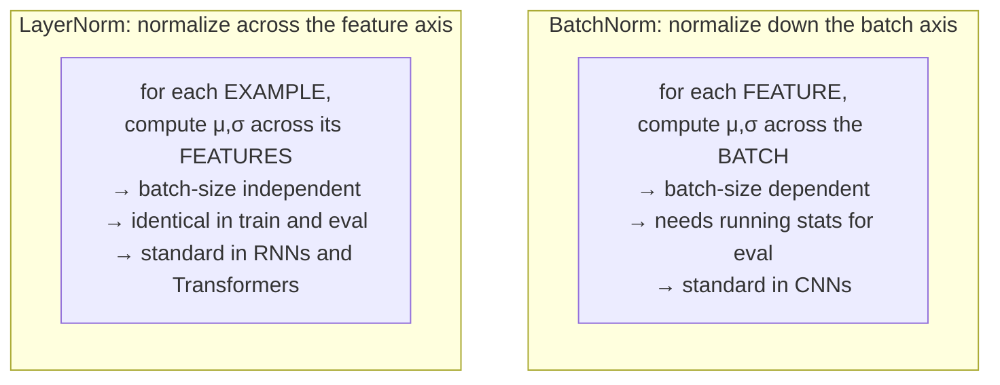

# 08 — Initialization, normalization, and the health of deep networks

Modules 05 and 06 gave you a correct gradient and a good rule for using it. This module is about a failure mode that arises before either matters: in a sufficiently deep network, the signal flowing forward and the gradient flowing backward can grow or shrink geometrically with depth, until the numbers involved are either infinite or indistinguishable from zero. When that happens, no optimizer helps, because there is nothing meaningful left to optimize with.

Here is the phenomenon, measured. Take 50 stacked 256-unit linear layers with ReLU, feed in unit-variance data, and record the standard deviation of the activations at each depth for four different weight initializations:[^m8-probe]

| Initialization | Layer 1 | Layer 5 | Layer 10 | Layer 25 | Layer 50 |
|---|---|---|---|---|---|
| $\mathcal{N}(0,1)$ | 9.3 | $1.2\times10^{5}$ | $2.3\times10^{10}$ | $9.6\times10^{25}$ | **`nan`** |
| $\mathcal{N}(0,0.01^2)$ | 0.093 | $1.7\times10^{-5}$ | $2.8\times10^{-10}$ | $1.9\times10^{-24}$ | **exactly 0** |
| Xavier | 0.58 | 0.14 | 0.024 | $1.2\times10^{-4}$ | $1.7\times10^{-8}$ |
| He | 0.83 | 0.91 | 0.93 | 0.95 | **0.66** |

Only the last row is usable, and the difference between the rows is a single scalar multiplying the initial weights. This module explains where that scalar comes from, why the third row — the "correct" classical answer — still fails for ReLU, and what normalization layers add once initialization alone is not enough.

> **Prerequisite:** [Module 05](./05-backpropagation-and-autodiff.md), specifically the delta recursion $\boldsymbol{\delta}^{(\ell)} = \big((W^{(\ell+1)})^\top\boldsymbol{\delta}^{(\ell+1)}\big)\odot\phi'(\mathbf{z}^{(\ell)})$, which is the object that vanishes or explodes.

## Vanishing and exploding gradients, quantified

The delta recursion says that going back one layer multiplies the gradient by $W^\top$ and by $\phi'$. Going back $L$ layers therefore multiplies it by a product of $L$ such factors. Products of many numbers behave very badly: if each factor is on average 0.9, the product after 50 layers is $0.9^{50} \approx 0.005$; if each is 1.1, it is $1.1^{50} \approx 117$. Exponential decay and exponential growth are the only two generic outcomes, and staying near 1 requires the factors to be near 1 *by design*.

Both failures are fatal in their own way. **Vanishing gradients** mean the early layers receive essentially no learning signal — they stay near their random initialization while the last few layers do all the work, so the network is effectively shallow no matter how many layers you declared. This is quiet: the loss goes down, slowly, and nothing looks broken. **Exploding gradients** are loud: a single huge update destroys the parameters and the loss becomes `nan` within a few steps.

Sigmoid activations make vanishing gradients unavoidable, as Module 03 noted: $\sigma' \le 0.25$ everywhere, so ten layers back the gradient has been multiplied by at most $0.25^{10} \approx 10^{-6}$ from the activation derivatives alone. Sepp Hochreiter identified this in 1991, and it is the direct reason for both the LSTM architecture of Module 11 and the residual connections of Module 10.[^m8-hochreiter] ReLU largely dissolves the activation half of the problem, since $\phi' = 1$ on the active region — but the weight matrices remain, and that is what initialization has to handle.

## Why the obvious initializations fail

Start by ruling out the two things a newcomer would try.

**All zeros** fails completely, and the reason is worth stating because it is structural rather than numerical. If every weight in a layer is identical, every unit in that layer computes the identical function, receives the identical gradient, and therefore performs the identical update — forever. The units never differentiate, and a 512-unit layer has the expressive power of one unit. Random initialization exists first and foremost to **break symmetry**; the specific distribution is a second-order concern that happens to matter enormously. (Biases, by contrast, can safely be initialized to zero, because the weights already break the symmetry.)

**Fixed-scale random values** fail for the reason the table shows. Draw from $\mathcal{N}(0,1)$ with 256 inputs per unit and each pre-activation is a sum of 256 products, giving it a standard deviation around $\sqrt{256}=16$ — so activations grow by an order of magnitude per layer and overflow to `nan` by layer 50. Draw from $\mathcal{N}(0,0.01^2)$ and the opposite happens: activations shrink toward zero and by layer 50 they are *exactly* zero in float32, at which point every gradient is zero and the network is dead. The scale of the initialization is not a detail. It is the difference between a network that trains and one that cannot.

## Xavier initialization, derived

The right question is: what variance should the weights have so that activations neither grow nor shrink as they propagate? Glorot and Bengio answered it in 2010, and the derivation is three lines.[^m8-glorot]

Consider one unit's pre-activation, $z_i = \sum_{j=1}^{n_{\text{in}}} W_{ij}a_j$. Assume the weights are independent, zero-mean, with variance $\mathrm{Var}(W)$, and independent of the activations, which are also zero-mean with variance $\mathrm{Var}(a)$. The variance of a sum of independent terms is the sum of their variances, and for independent zero-mean variables $\mathrm{Var}(XY) = \mathrm{Var}(X)\mathrm{Var}(Y)$, so

$$\mathrm{Var}(z_i) = \sum_{j=1}^{n_{\text{in}}}\mathrm{Var}(W_{ij})\,\mathrm{Var}(a_j) = n_{\text{in}}\,\mathrm{Var}(W)\,\mathrm{Var}(a)$$

For the variance to be preserved layer to layer — $\mathrm{Var}(z) = \mathrm{Var}(a)$ — you need

$$\mathrm{Var}(W) = \frac{1}{n_{\text{in}}}$$

That is the forward condition. Now run the same argument on the backward pass. The delta recursion multiplies by $W^\top$, and by identical reasoning the gradient variance is preserved when $\mathrm{Var}(W) = 1/n_{\text{out}}$. The two conditions conflict whenever the layer is not square, so Glorot and Bengio split the difference with the harmonic-mean-flavored compromise

$$\mathrm{Var}(W) = \frac{2}{n_{\text{in}} + n_{\text{out}}}$$

which is **Xavier** (or Glorot) initialization. In uniform form it draws from $\mathcal{U}[-a, a]$ with $a = \sqrt{6/(n_{\text{in}}+n_{\text{out}})}$, where the 6 comes from a uniform distribution on $[-a,a]$ having variance $a^2/3$.

Xavier was a genuine breakthrough — it made networks of a dozen layers trainable that previously were not — and the table at the top of this module shows it still failing at depth 50 with ReLU, decaying to $1.7\times10^{-8}$. The derivation assumed the activation is roughly linear near zero and symmetric, which is true of tanh and false of ReLU.

## He initialization, and the factor of two

He and colleagues spotted the discrepancy in 2015.[^m8-he] ReLU sets every negative pre-activation to zero. If the pre-activations are symmetric about zero, that is half of them, so the variance of the post-activation is roughly *half* the variance of the pre-activation:

$$\mathrm{Var}(a) = \mathbb{E}[a^2] \approx \tfrac{1}{2}\mathrm{Var}(z)$$

Every ReLU layer halves the variance, and $0.5^{50} \approx 10^{-15}$ — which is precisely the decay observed in the Xavier row. The fix is to compensate by doubling the weight variance:

$$\mathrm{Var}(W) = \frac{2}{n_{\text{in}}}$$

That single factor of two is the entire difference between the third and fourth rows of the table, and between a 50-layer network whose activations have collapsed to $10^{-8}$ and one whose activations are still around 0.9. He and colleagues reported that it was the difference between a 30-layer network training and not training at all, and it is a good example of how a small quantitative correction can be qualitatively decisive.

In PyTorch:

```python
for m in model.modules():
    if isinstance(m, (nn.Linear, nn.Conv2d)):
        nn.init.kaiming_normal_(m.weight, mode="fan_in", nonlinearity="relu")
        if m.bias is not None:
            nn.init.zeros_(m.bias)
```

The `nonlinearity=` argument selects the gain: `relu` gives $\sqrt{2}$, `tanh` gives $5/3$, `linear` gives 1. `mode="fan_in"` preserves forward variance and `"fan_out"` preserves backward; either is defensible and fan-in is the more common choice.

It is worth knowing what PyTorch does if you say nothing. `nn.Linear` defaults to Kaiming *uniform* with `a=math.sqrt(5)`, a legacy setting that works out to roughly $\mathcal{U}[-1/\sqrt{n_\text{in}}, 1/\sqrt{n_\text{in}}]$ — closer to Xavier than to He, and adequate for the shallow networks most people write, which is why you can usually get away with ignoring initialization entirely. For anything deep, set it explicitly. And note that all of this assumes your *inputs* are also standardized; feeding raw pixel values in $[0,255]$ into a carefully initialized network wrecks the first layer's variance immediately, which is why `transforms.Normalize` is not optional.

## Batch normalization

Good initialization sets the activation statistics correctly at step zero. It cannot keep them correct, because the weights change. As training proceeds the distribution of each layer's inputs drifts, and a deep network becomes a stack of layers each chasing a moving target. Normalization layers address this by *enforcing* the statistics rather than merely arranging them once.

**Batch normalization** standardizes each feature across the batch dimension.[^m8-bn] For a minibatch $\mathcal{B}$ and a given feature:

$$\mu_\mathcal{B} = \frac{1}{B}\sum_{i=1}^{B}x_i,\qquad \sigma^2_\mathcal{B} = \frac{1}{B}\sum_{i=1}^{B}(x_i-\mu_\mathcal{B})^2,\qquad \hat{x}_i = \frac{x_i - \mu_\mathcal{B}}{\sqrt{\sigma^2_\mathcal{B}+\epsilon}}$$

$$y_i = \gamma\hat{x}_i + \beta$$

The first line forces zero mean and unit variance. The second line is essential and often glossed over: $\gamma$ and $\beta$ are *learned* parameters, one pair per feature, that let the network scale and shift the normalized value back to whatever distribution is actually useful. Without them, normalization would be a strict loss of expressiveness — you would have forbidden the layer from ever producing, say, a saturated sigmoid input. With them, the network *can* undo the normalization exactly (by setting $\gamma = \sigma_\mathcal{B}$, $\beta = \mu_\mathcal{B}$), so nothing is lost; what changes is that the mean and variance are now controlled by two dedicated parameters rather than emerging from the interaction of every weight in every preceding layer. That decoupling is the real benefit, and it is why BatchNorm makes training so much less sensitive to learning rate and initialization.

The complication is inference. A batch mean is undefined for a single example, and you do not want your prediction for one input to depend on which other inputs happened to be batched with it. So BatchNorm maintains **running estimates** of the mean and variance during training — exponential moving averages, with `momentum=0.1` by default in PyTorch — and uses those fixed statistics at test time. This is the second reason `model.train()` and `model.eval()` matter, alongside dropout, and it produces a distinctive bug: a model that looks fine during training and performs terribly at evaluation, because the running statistics were never properly updated (too few training steps) or because you forgot to call `eval()`. If you ever see evaluation accuracy that is inexplicably far below training accuracy *on the same data*, check this first.

**Why does BatchNorm work?** This is a genuine open disagreement in the field and you should know both sides. The original paper attributed it to reducing "internal covariate shift" — the drift in layer input distributions described above — and that explanation is still what most tutorials repeat. Santurkar and colleagues tested it directly in 2018 by injecting deliberate distribution shift *after* BatchNorm layers; the networks trained just as well, which the covariate-shift story cannot explain. Their proposed alternative is that BatchNorm makes the optimization landscape smoother, reducing the Lipschitz constant of the loss and its gradients, so that gradients are more predictive over longer distances and larger learning rates become safe.[^m8-santurkar] Other work emphasizes the length-direction decoupling of the weights, and the regularizing effect of the batch statistics being noisy. The honest position is that BatchNorm reliably works, that the original explanation for it is probably wrong, and that no single replacement has become consensus. That is not unusual in this field, and it is worth being able to say so rather than reciting the 2015 story as settled.

Two practical consequences follow regardless of the explanation. BatchNorm depends on batch statistics, so it **degrades at small batch sizes** — below about 16 the estimates get noisy and below 8 it can be worse than nothing, which is why GroupNorm exists for memory-constrained tasks like detection and segmentation. And a BatchNorm layer immediately after a linear or convolutional layer makes that layer's bias redundant, since the mean subtraction removes any constant offset; hence `nn.Conv2d(..., bias=False)` in every ResNet implementation you will read.

## LayerNorm, and why sequences need it

**Layer normalization** normalizes over the *feature* dimension of each example independently, rather than over the batch:[^m8-ln]

$$\mu_i = \frac{1}{d}\sum_{k=1}^{d}x_{ik},\qquad \sigma_i^2 = \frac{1}{d}\sum_{k=1}^{d}(x_{ik}-\mu_i)^2,\qquad y_{ik} = \gamma_k\frac{x_{ik}-\mu_i}{\sqrt{\sigma_i^2+\epsilon}}+\beta_k$$

The distinction is exactly which axis you average over, and it changes everything downstream. Because each example is normalized using only its own features, LayerNorm behaves **identically in training and inference**, needs no running statistics, and is completely independent of batch size — you can train with batch size 1.

That last property is why sequence models use it. Recurrent networks and Transformers process variable-length sequences, so batch statistics at a given time step are computed over however many sequences happen to be that long, which is unstable and leaks information across the batch. Autoregressive generation runs one example at a time. LayerNorm sidesteps all of it. Every Transformer in Module 12 uses LayerNorm, and it is not an incidental choice.



The family has more members, all defined by which axes they average over. **InstanceNorm** normalizes each channel of each example separately and is standard in style transfer. **GroupNorm** splits channels into groups and normalizes within each, interpolating between LayerNorm (one group) and InstanceNorm (one channel per group); it matches BatchNorm's accuracy while being batch-size independent, which is why it is used in detection and segmentation.[^m8-gn] **RMSNorm** drops the mean-centering entirely and divides only by the root-mean-square, which is cheaper and works about as well; it is used in LLaMA and many recent large language models.[^m8-rmsnorm]

## Where to put the normalization

One placement question has a clear modern answer and is worth knowing before Module 12. In a residual block — the pattern $\mathbf{x} + F(\mathbf{x})$ from Module 10 — you can normalize either after adding the residual (**post-norm**, as in the original Transformer and the original ResNet) or inside the branch before the function (**pre-norm**):

$$\text{post-norm: } \mathbf{x}_{\ell+1} = \mathrm{LN}\big(\mathbf{x}_\ell + F(\mathbf{x}_\ell)\big) \qquad\qquad \text{pre-norm: } \mathbf{x}_{\ell+1} = \mathbf{x}_\ell + F\big(\mathrm{LN}(\mathbf{x}_\ell)\big)$$

Pre-norm leaves a completely clean identity path from input to output with no normalization on it, so gradients reach early layers undiminished. Post-norm puts a LayerNorm on that path, and empirically requires careful learning-rate warmup to train deep stacks at all. Xiong and colleagues analyzed this and showed pre-norm Transformers can be trained without warmup and are substantially more stable at depth.[^m8-prenorm] Essentially all modern large Transformers are pre-norm. The original 2017 paper is post-norm, which is a small trap if you implement from the paper and wonder why your 24-layer model diverges.

## Before you move on

Signal magnitude in a deep network is a product of per-layer factors, so it decays or grows geometrically unless each factor is deliberately kept near one — that is the whole content of vanishing and exploding gradients, and the measured table at the top shows it costing thirty orders of magnitude over fifty layers. Initialization must break symmetry, so zeros are disqualified, and must set the right variance: $1/n_\text{in}$ preserves forward variance, Xavier compromises between forward and backward, and He doubles it to $2/n_\text{in}$ to compensate for ReLU zeroing half the units. Normalization layers enforce the statistics rather than merely setting them once, with learned $\gamma$ and $\beta$ so nothing is lost; BatchNorm normalizes across the batch and therefore needs running statistics and a healthy batch size, LayerNorm normalizes across features and therefore does not. And pre-norm placement keeps the residual path clean, which is why modern deep stacks use it.

If you can derive $\mathrm{Var}(W) = 1/n_\text{in}$ from the variance of a sum, explain the factor of two in He initialization in terms of what ReLU does to a symmetric distribution, and say why a Transformer uses LayerNorm rather than BatchNorm without appealing to convention, this module has done its work. A good self-check: predict, before running it, what the activation-scale table would look like for tanh instead of ReLU — and then note that the measured tanh rows show Xavier decaying only to $9.7\times10^{-2}$ rather than $10^{-8}$, because the factor-of-two problem is specific to rectifiers.[^m8-probe] [Exercise Set 08](./exercises/08-exercises.md) then has you discover something the module only hints at: PyTorch's own default `nn.Linear` initialization is a factor of $\sqrt{1/6}$ below He, and at depth ten that is enough to stop a network learning at all.

Next, [Module 09](./09-practical-training-and-debugging.md) assembles Modules 03 through 08 into a working practice: how to build the pipeline, how to choose hyperparameters efficiently, and what to do when a model refuses to learn.

## Sources

[^m8-probe]: Measured while writing this module: 50 stacked $256\times256$ linear layers with ReLU (and separately tanh), unit-variance input, 512 samples, reporting the standard deviation of activations at each depth. The tanh rows were Xavier $\{0.63, 0.32, 0.23, 0.14, 0.097\}$ and He $\{0.72, 0.57, 0.55, 0.56, 0.56\}$ at layers 1/5/10/25/50. Script in the [Module 08 solutions](./exercises/solutions/08-solutions.md).

[^m8-hochreiter]: Sepp Hochreiter's 1991 diploma thesis is the original analysis; the accessible reference is Yoshua Bengio, Patrice Simard and Paolo Frasconi, ["Learning long-term dependencies with gradient descent is difficult"](https://ieeexplore.ieee.org/document/279181), *IEEE Transactions on Neural Networks* 5(2), 1994.

[^m8-glorot]: Xavier Glorot and Yoshua Bengio, ["Understanding the difficulty of training deep feedforward neural networks"](https://proceedings.mlr.press/v9/glorot10a.html), AISTATS 2010. The variance derivation in this module is Section 4.2 of that paper.

[^m8-he]: Kaiming He, Xiangyu Zhang, Shaoqing Ren and Jian Sun, ["Delving Deep into Rectifiers: Surpassing Human-Level Performance on ImageNet Classification"](https://arxiv.org/abs/1502.01852), ICCV 2015. Section 2.2 contains the factor-of-two argument and the 30-layer training comparison.

[^m8-bn]: Sergey Ioffe and Christian Szegedy, ["Batch Normalization: Accelerating Deep Network Training by Reducing Internal Covariate Shift"](https://arxiv.org/abs/1502.03167), ICML 2015.

[^m8-santurkar]: Shibani Santurkar, Dimitris Tsipras, Andrew Ilyas and Aleksander Madry, ["How Does Batch Normalization Help Optimization?"](https://arxiv.org/abs/1805.11604), NeurIPS 2018. Read the abstract and Section 3 for the direct refutation of the internal-covariate-shift explanation. This remains a live disagreement rather than a settled replacement.

[^m8-ln]: Jimmy Lei Ba, Jamie Ryan Kiros and Geoffrey Hinton, ["Layer Normalization"](https://arxiv.org/abs/1607.06450), 2016.

[^m8-gn]: Yuxin Wu and Kaiming He, ["Group Normalization"](https://arxiv.org/abs/1803.08494), ECCV 2018. Figure 1 shows the BatchNorm accuracy collapse at small batch sizes clearly.

[^m8-rmsnorm]: Biao Zhang and Rico Sennrich, ["Root Mean Square Layer Normalization"](https://arxiv.org/abs/1910.07467), NeurIPS 2019.

[^m8-prenorm]: Ruibin Xiong et al., ["On Layer Normalization in the Transformer Architecture"](https://arxiv.org/abs/2002.04745), ICML 2020.

**Further reading.** *Deep Learning* [Section 8.4](https://www.deeplearningbook.org/contents/optimization.html) covers parameter initialization strategies and [Section 8.7.1](https://www.deeplearningbook.org/contents/optimization.html) covers batch normalization. *Dive into Deep Learning* [Section 5.4](https://d2l.ai/chapter_multilayer-perceptrons/numerical-stability-and-init.html) derives the variance conditions with runnable experiments, and [Section 8.5](https://d2l.ai/chapter_convolutional-modern/batch-norm.html) treats normalization with unusually good honesty about the explanatory dispute. The [CS231n neural networks notes, part 2](https://cs231n.github.io/neural-networks-2/) cover initialization and normalization from a practitioner's perspective. PyTorch's [`torch.nn.init`](https://pytorch.org/docs/stable/nn.init.html) documents every scheme with its exact gain values, and [`nn.BatchNorm2d`](https://pytorch.org/docs/stable/generated/torch.nn.BatchNorm2d.html) states precisely how the running statistics are maintained.
