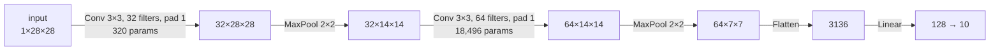

# 10 — Convolutional networks

The MLP has saturated. Module 09's fully-tuned recipe reached 98.28% on MNIST and there is not much more to extract, because the model is fighting a handicap no amount of tuning removes: it does not know that an image has spatial structure. As Module 03 noted, you could apply a fixed random permutation to all 784 pixel positions across the entire dataset and the MLP would learn exactly as well. That is an enormous amount of thrown-away information.

This module is about putting that information back — not through the data or the optimizer, but through the *architecture*. Building the right assumptions into the function class is the central idea of the book's second half, and convolution is its clearest instance. The same MNIST task, with a small convolutional network and the identical training recipe, reaches **99.27%**.[^m10-cnn] Cutting the error rate by 58% is not a tuning result; it is what happens when the model is told that neighbouring pixels are related.

> **Prerequisite:** [Module 09](./09-practical-training-and-debugging.md) — the training pipeline, plus initialization and normalization from [Module 08](./08-initialization-and-normalization.md).

## Why fully-connected layers are the wrong shape for images

Two problems, and the second is more fundamental than the first.

The arithmetic problem is scale. A modest 224×224 colour image has 150,528 input values. A single fully-connected layer mapping that to 1,000 hidden units needs $224\times224\times3\times1000 \approx 1.5\times10^{8}$ weights — 150 million parameters, for one layer, before the network has done anything.[^m10-params] A 3×3 convolutional layer producing 64 channels from that same image needs **1,792**. Five orders of magnitude.

The structural problem is that the fully-connected layer learns each position independently. If it learns to detect a vertical edge at the top-left corner, that knowledge is stored in weights that connect only to top-left pixels, and it confers no ability whatsoever to detect a vertical edge in the top-right corner — that must be learned separately, from separate examples. The concept "vertical edge" would have to be relearned 150,000 times over.

Both problems are solved by two assumptions, and it is worth naming them because they are exactly the prior knowledge being installed. **Locality**: meaningful visual features are local, so a unit should look at a small neighbourhood rather than the whole image. **Translation invariance**: a feature detector useful at one location is useful at every location, so the *same* weights should be applied everywhere. Convolution is the operation that implements both.

## The convolution operation

Take a small array of weights called a **kernel** or **filter** — 3×3 is the modern standard — and slide it over the input. At each position, compute the elementwise product with the patch beneath it and sum:

$$(I * K)_{ij} = \sum_{m}\sum_{n} I_{i+m,\,j+n}\,K_{m,n}$$

That is a dot product between the kernel and a local patch, which by Module 02's reading is a *similarity score*: the output at each position measures how much the local neighbourhood resembles the pattern the kernel encodes. A kernel like $\begin{smallmatrix}-1&0&1\\-1&0&1\\-1&0&1\end{smallmatrix}$ responds strongly where brightness increases left-to-right, so its output map lights up along vertical edges. The crucial difference from the classical computer-vision era is that nobody designs these kernels — they are parameters, initialized randomly and learned by the gradient descent of Module 06 like any other weight.

(A pedantic but occasionally useful note: what deep learning calls convolution is technically *cross-correlation*, since true convolution flips the kernel. Because the kernel is learned, the flip is irrelevant — the network simply learns the flipped kernel — and every framework implements cross-correlation. The literature has settled on calling it convolution and so does this book.)

Three properties follow immediately from that definition, and together they are the entire justification for the architecture. **Sparse connectivity**: each output depends on only $K^2$ inputs rather than all of them, so the parameter count is independent of image size. **Parameter sharing**: the same kernel is used at every position, so a feature learned anywhere is available everywhere — and, recalling Module 05's rule that a reused parameter's gradient sums over its uses, each kernel weight receives gradient from every spatial position, which is a great deal of signal per parameter. **Translation equivariance**: shift the input and the output shifts identically, $f(\text{shift}(x)) = \text{shift}(f(x))$, so spatial relationships are preserved rather than scrambled.

### Shapes: the arithmetic you must be able to do by hand

Three hyperparameters control the geometry. **Padding** $P$ adds a border of zeros so that output size can be preserved and border pixels are not undersampled. **Stride** $S$ is the step between successive positions; a stride of 2 halves the resolution. **Dilation** spaces the kernel's taps out to enlarge its reach without adding parameters. The output size is

$$H_{\text{out}} = \left\lfloor\frac{H_{\text{in}} + 2P - K}{S}\right\rfloor + 1$$

Memorize this. Almost every shape error in convolutional code is this formula being violated, and being able to evaluate it mentally converts a confusing runtime error into an obvious one. Verified against PyTorch: a 28×28 input with $K{=}5, S{=}1, P{=}0$ gives 24; with $K{=}3, S{=}1, P{=}1$ it gives 28 (the "same" configuration, which is why 3×3 with padding 1 is ubiquitous); a 32×32 input with $K{=}3, S{=}2, P{=}1$ gives 16; and AlexNet's first layer, 224×224 with $K{=}11, S{=}4, P{=}2$, gives 55.[^m10-shape]

Real layers operate on **multiple channels**. An input of $C_{\text{in}}$ channels convolved to $C_{\text{out}}$ channels uses a kernel of shape $(C_{\text{out}}, C_{\text{in}}, K, K)$: each output channel has its own filter that spans *all* input channels and sums across them. So each output channel is a different learned combination of local patterns from every input channel. The parameter count is

$$C_{\text{out}} \times C_{\text{in}} \times K \times K + C_{\text{out}}$$

For 32→64 channels with a 3×3 kernel that is $3\cdot3\cdot32\cdot64 + 64 = 18{,}496$ — verified against `nn.Conv2d(32, 64, 3)`.[^m10-shape] Note what is absent from that expression: the spatial size of the image. A convolutional layer has the same parameter count whether it processes 28×28 or 2800×2800 inputs.



## Pooling and the receptive field

**Pooling** downsamples by replacing each small window with a single summary — its maximum (most common) or its mean. It has no parameters. Its purposes are to reduce spatial resolution so that later layers are cheaper, and to add a degree of *invariance*: max-pooling over a 2×2 window returns the same value regardless of which of the four positions the maximum occupied, so small translations stop mattering. Note the distinction from convolution's equivariance — convolution preserves position information, pooling deliberately discards a little of it.

Pooling's role has diminished. Strided convolutions achieve the same downsampling while *learning* how to summarize rather than applying a fixed rule, and most modern architectures use them instead. What survives universally is **global average pooling** at the end of a network: collapse each channel's entire spatial map to its mean, producing one number per channel. This replaces the enormous flatten-then-fully-connected head of early architectures, removes most of their parameters, and makes the network accept any input size.

The **receptive field** — the region of the original image that influences one particular activation — is the concept that explains why depth matters here specifically. One 3×3 convolution sees 3×3. Stack a second and each of its outputs sees a 3×3 window of first-layer outputs, each of which saw 3×3, so the receptive field is 5×5. A third makes it 7×7. Stacking $L$ layers of $K\times K$ convolutions with stride 1 gives a receptive field of $1 + L(K-1)$, and pooling or striding multiplies it. So early layers see edges, middle layers see textures and parts, and deep layers see whole objects — the hierarchy of features that makes convolutional networks work is a direct consequence of receptive field growth with depth.

## LeNet-5: the first one that worked

Yann LeCun's LeNet-5 has every idea above, in 1998.[^m10-lenet] Two convolution-and-pooling stages followed by three fully-connected layers, with tanh activations and average pooling, reading handwritten digits on real cheques.

```python
lenet = nn.Sequential(
    nn.Conv2d(1, 6, 5, padding=2), nn.Tanh(), nn.AvgPool2d(2),   # 1×28×28 → 6×14×14
    nn.Conv2d(6, 16, 5),           nn.Tanh(), nn.AvgPool2d(2),   # → 16×5×5
    nn.Flatten(),
    nn.Linear(16 * 5 * 5, 120), nn.Tanh(),
    nn.Linear(120, 84),         nn.Tanh(),
    nn.Linear(84, 10),
)   # 61,706 parameters
```

61,706 parameters — *fewer* than the 101,770-parameter MLP of Module 03, and far more capable, because the parameters are spent on reusable local detectors rather than on position-specific weights.[^m10-shape] That comparison is the whole argument for convolution in one line.

Modernizing LeNet is a good exercise in the last eight modules: swap tanh for ReLU (Module 03), average pooling for max pooling, add BatchNorm (Module 08) and dropout (Module 07), and train with AdamW and a cosine schedule (Module 06). The result, a two-block CNN with 421,834 parameters, reaches **99.27%** on MNIST in 12 seconds — versus the MLP's 98.28%.[^m10-cnn]

```python
cnn = nn.Sequential(
    nn.Conv2d(1, 32, 3, padding=1), nn.BatchNorm2d(32), nn.ReLU(), nn.MaxPool2d(2),
    nn.Conv2d(32, 64, 3, padding=1), nn.BatchNorm2d(64), nn.ReLU(), nn.MaxPool2d(2),
    nn.Flatten(),
    nn.Linear(64 * 7 * 7, 128), nn.ReLU(), nn.Dropout(0.25),
    nn.Linear(128, 10),
)
```

## AlexNet: the same ideas, scaled

AlexNet in 2012 is architecturally LeNet with more layers and more filters, and its 15.3% top-5 ImageNet error against the runner-up's 26.2% is the moment described in Module 01.[^m10-alexnet] What made the scale-up work is a short list, and every item is something you have already studied.

ReLU instead of tanh, which the authors credited with roughly a six-fold speedup to a given training error — the vanishing-gradient argument of Modules 03 and 08. Training split across two GPUs, because the model did not fit on one; this is why the original architecture diagram is drawn as two parallel streams. Dropout at 0.5 in the fully-connected layers, published as a preprint the same year and essential given that those layers held most of the 60 million parameters (Module 7). Aggressive data augmentation with random crops, flips, and colour jitter, which the paper says was necessary to prevent substantial overfitting. And overlapping max pooling, a minor detail that has not survived.

The lesson worth taking is that AlexNet contained almost no new *ideas*. It was the systematic application of known techniques at a scale that new data and new hardware had just made possible — the four-factor convergence of Module 01, made concrete.

## VGG: depth through uniformity

VGG's contribution in 2014 was a design principle rather than a mechanism: use only 3×3 convolutions with stride 1 and padding 1, stack them in blocks, halve the resolution and double the channels at each block boundary.[^m10-vgg] The resulting 16- and 19-layer networks were the deepest that had worked well, and the uniformity made them trivially easy to reason about and to reimplement.

The justification for insisting on 3×3 is a nice piece of arithmetic worth doing yourself. Two stacked 3×3 convolutions have the same 5×5 receptive field as one 5×5 convolution, and three stacked have the same 7×7 receptive field as one 7×7. But for $C$ channels, one 5×5 layer costs $25C^2$ parameters while two 3×3 layers cost $18C^2$ — a factor of **1.39** saved. One 7×7 costs $49C^2$ against three 3×3 at $27C^2$, a factor of **1.81**.[^m10-shape] And the stacked version interposes two or three nonlinearities where the large kernel has one, making it strictly more expressive. Smaller kernels stacked deeper are better on both counts simultaneously, which is why essentially every convolutional architecture since 2014 is built from 3×3 kernels.

VGG's flaw was its fully-connected head, which consumed roughly 90% of its 138 million parameters — the same fully-connected pathology this module opened with, surviving at the end of an otherwise convolutional network. Global average pooling later removed it.

One more building block belongs here. A **1×1 convolution** looks pointless — a kernel that sees a single pixel — until you remember the channel dimension. A 1×1 convolution is a learned linear transformation across channels applied identically at every spatial position, which makes it the standard tool for cheaply changing channel count. Reducing 256 channels to 64 with a 1×1 convolution before an expensive 3×3 costs a fraction of doing the 3×3 at full width. This is the core trick of the Inception architecture and of ResNet's bottleneck blocks.[^m10-inception]

## ResNet: the degradation problem and its fix

By 2015 the obvious next move was more depth, and it did not work. He and colleagues documented something genuinely surprising: a 56-layer plain network had **higher training error** than a 20-layer one.[^m10-resnet] Not higher test error — that would be overfitting, which is understood. Higher *training* error, meaning the deeper network could not even fit the data as well.

This is logically strange, and seeing why is the key to the whole architecture. The 56-layer network *contains* the 20-layer one as a special case: set the extra 36 layers to compute the identity function and you have exactly the shallower model. So the deeper network's optimum is at least as good as the shallower one's. The problem is not representational capacity, and it is not overfitting. It is that gradient descent cannot *find* that solution. The authors named it the **degradation problem**, and its diagnosis is that a stack of nonlinear layers finds it surprisingly hard to learn to do nothing.

The fix follows directly from the diagnosis. If the difficulty is representing the identity, then build the identity into the architecture and make the layers learn a *departure* from it:

$$\mathbf{y} = F(\mathbf{x}, \{W_i\}) + \mathbf{x}$$

The layers now compute a **residual** $F(\mathbf{x}) = \mathbf{y} - \mathbf{x}$ rather than the full mapping. Learning to do nothing means driving $F$ toward zero — which is exactly what weight decay and small initialization already push toward, and is far easier than learning to reproduce an input exactly through several nonlinear layers.

The gradient argument is the other half, and it falls out of Module 05's chain rule. Differentiating through the skip connection,

$$\frac{\partial \mathbf{y}}{\partial\mathbf{x}} = \frac{\partial F}{\partial\mathbf{x}} + I$$

That $+I$ means the gradient always has an *unimpeded path* backwards. Even if $\partial F/\partial\mathbf{x}$ shrinks toward zero, the identity term guarantees the gradient reaches earlier layers undiminished. Instead of a product of many small factors, the backward pass gets a sum of paths, and the shortest path has no attenuation at all.

Measured on a 30-block network, this is exactly what happens. In a plain stack, the ratio of the gradient norm at block 1 to block 30 is **236** — wildly unbalanced. With residual connections, the same ratio is **5.5**.[^m10-grad] The gradient is distributed across depth rather than concentrated at one end.

And the degradation itself reproduces. Training 10- and 30-block networks on MNIST with identical settings and comparing *final training loss*:[^m10-degrade]

| Depth | Plain | Residual | Residual + zero-init γ |
|---|---|---|---|
| 10 blocks | 0.1877 | 0.0760 | 0.0014 |
| 30 blocks | **2.0847** | 0.7711 | **0.0010** |

Read the first column: tripling the depth of the plain network made the training loss eleven times *worse*. That is He et al.'s observation, reproduced in a few minutes. The second column shows residual connections recovering most of it, and the third shows something further — initializing the final BatchNorm scale $\gamma$ of each block to zero, so every block starts as an exact identity, makes the 30-block network train *as well as* the 10-block one. Depth becomes free. That zero-init trick is standard practice in modern ResNet implementations and is one of those details that sounds cosmetic and is not.[^m10-goyal]

Here is the block, in the standard form:

```python
class ResidualBlock(nn.Module):
    def __init__(self, channels):
        super().__init__()
        self.conv1 = nn.Conv2d(channels, channels, 3, padding=1, bias=False)
        self.bn1   = nn.BatchNorm2d(channels)
        self.conv2 = nn.Conv2d(channels, channels, 3, padding=1, bias=False)
        self.bn2   = nn.BatchNorm2d(channels)
        nn.init.zeros_(self.bn2.weight)      # block starts as exact identity

    def forward(self, x):
        out = torch.relu(self.bn1(self.conv1(x)))
        out = self.bn2(self.conv2(out))
        return torch.relu(out + x)           # the skip connection
```

Two details worth noting. `bias=False` because the BatchNorm that follows subtracts the mean anyway, making the bias redundant (Module 08). And when a block changes channel count or spatial size, the skip cannot be a bare identity — you insert a 1×1 convolution with matching stride on the shortcut path to make the shapes agree. For deep variants, the **bottleneck block** sandwiches a 3×3 convolution between two 1×1 convolutions that first reduce and then restore the channel count, which is how ResNet-50/101/152 stay affordable.

ResNet won ImageNet 2015 with 152 layers at 3.57% top-5 error, and the residual connection has since become close to universal — it is in every Transformer in Module 12, in every large language model, in essentially every deep architecture built since. If you take one architectural idea from this book, take this one.

## The landscape after ResNet

A brief map, since these names appear constantly. **DenseNet** connects every layer to every subsequent layer within a block by concatenation rather than addition, maximizing feature reuse.[^m10-densenet] **Squeeze-and-Excitation** blocks learn per-channel weights from global context, an early form of attention inside a CNN.[^m10-se] **MobileNet** and **EfficientNet** target efficiency — depthwise separable convolutions factor a standard convolution into a per-channel spatial filter followed by a 1×1 mixing step, cutting cost by roughly an order of magnitude, and EfficientNet's compound scaling shows that depth, width, and resolution should be scaled together rather than one at a time.[^m10-efficientnet] **Vision Transformers** apply Module 12's architecture directly to image patches and beat CNNs given enough data, though they lack convolution's built-in locality prior and are correspondingly hungrier.[^m10-vit] And **ConvNeXt** modernized a plain ResNet with the Transformer era's training recipes and design choices, matching Transformer performance — a useful corrective to the idea that the architecture alone was responsible for the gains.[^m10-convnext]

The practical advice is unchanged by any of this: for a new vision problem, start with a pretrained ResNet-50 or EfficientNet and fine-tune it. Module 13 explains how and why that is almost always better than training from scratch.

## Before you move on

Convolution installs two priors — locality and translation invariance — and buys sparse connectivity, parameter sharing, and equivariance, which is why LeNet beats a larger MLP with fewer parameters. The output-shape formula $\lfloor (H+2P-K)/S\rfloor + 1$ and the parameter count $C_\text{out}C_\text{in}K^2 + C_\text{out}$ should be things you evaluate mentally. Receptive field grows with depth, which is what produces the edge-to-part-to-object hierarchy. The architectural progression is a sequence of specific fixes: AlexNet scaled LeNet with ReLU, dropout, augmentation and GPUs; VGG showed stacked 3×3 kernels beat large ones on both parameter count and nonlinearity count; and ResNet solved the degradation problem by making the identity the default so that layers learn departures from it, which also leaves an unattenuated gradient path.

If you can compute the output shape and parameter count of a convolutional layer without a computer, explain why two 3×3 convolutions beat one 5×5 on two independent grounds, and articulate why a 56-layer plain network having *higher training error* than a 20-layer one is a statement about optimization rather than capacity, you have this module. The measured degradation table is worth reproducing yourself — it is the most instructive experiment in the book. [Exercise Set 10](./exercises/10-exercises.md) has you implement 2-D convolution with four nested loops, rebuild it as a matrix multiply via im2col, verify both against `F.conv2d` to machine precision, and demonstrate translation equivariance exactly.

Next, [Module 11](./11-sequence-models.md) changes domain. Images have spatial structure; language and time series have *sequential* structure, with variable length and long-range dependence, and that requires a different prior entirely.

## Sources

[^m10-cnn]: Measured while writing this module: the two-block CNN shown above, 421,834 parameters, AdamW at 1e-3 with weight decay 1e-2, cosine schedule, 5 epochs, batch size 128 — 99.27% MNIST test accuracy in 12 seconds on an Apple M-series GPU, against the Module 09 MLP's 98.28%. Script in the [Module 10 solutions](./exercises/solutions/10-solutions.md).

[^m10-params]: $224\times224\times3\times1000 = 150{,}528{,}000$ against $3\times3\times3\times64 + 64 = 1{,}792$; both verified numerically.

[^m10-shape]: All shape and parameter arithmetic in this module was checked against PyTorch: the output-size formula on five configurations, `nn.Conv2d(32,64,3)` at 18,496 parameters, the 5×5-versus-two-3×3 ratio of 1.389 and 7×7-versus-three-3×3 ratio of 1.815, and LeNet-5 at 61,706 parameters producing a correct `(1,10)` output from a `(1,1,28,28)` input.

[^m10-lenet]: Yann LeCun, Léon Bottou, Yoshua Bengio and Patrick Haffner, ["Gradient-Based Learning Applied to Document Recognition"](http://yann.lecun.com/exdb/publis/pdf/lecun-98.pdf), *Proceedings of the IEEE* 86(11), 1998. The variant above is the standard 28×28 adaptation; the original takes 32×32 input.

[^m10-alexnet]: Alex Krizhevsky, Ilya Sutskever and Geoffrey Hinton, ["ImageNet Classification with Deep Convolutional Neural Networks"](https://papers.nips.cc/paper_files/paper/2012/hash/c399862d3b9d6b76c8436e924a68c45b-Abstract.html), NeurIPS 2012.

[^m10-vgg]: Karen Simonyan and Andrew Zisserman, ["Very Deep Convolutional Networks for Large-Scale Image Recognition"](https://arxiv.org/abs/1409.1556), ICLR 2015. Section 2.3 makes the stacked-3×3 argument.

[^m10-inception]: Christian Szegedy et al., ["Going Deeper with Convolutions"](https://arxiv.org/abs/1409.4842), CVPR 2015. The 1×1 bottleneck idea traces to Min Lin, Qiang Chen and Shuicheng Yan, ["Network In Network"](https://arxiv.org/abs/1312.4400), 2013, which also introduced global average pooling.

[^m10-resnet]: Kaiming He, Xiangyu Zhang, Shaoqing Ren and Jian Sun, ["Deep Residual Learning for Image Recognition"](https://arxiv.org/abs/1512.03385), CVPR 2016. Figure 1 is the degradation plot; Section 3.1 is the identity-mapping argument.

[^m10-grad]: Measured: 30 blocks of `Linear→BN→ReLU` at width 128 on MNIST, gradient norm at block 1 divided by gradient norm at block 30, single backward pass from identical initialization. Plain 236.3, residual 5.5. At depth 10 the two are comparable (5.2 versus 3.4), which is consistent with the problem being depth-specific.

[^m10-degrade]: Measured: blocks of `Linear→ReLU→Linear→BN`, width 128, on 10,000 MNIST images, SGD with momentum 0.9 at lr 0.05, 15 epochs, identical seed. Final *training* loss reported, since degradation is a training-set phenomenon. An earlier attempt using a naive `x + block(x)` without the final BatchNorm inside the branch did *not* reproduce the residual advantage at depth 30, because activation variance accumulates along the skip path — which is itself a good illustration that the block's internal design matters, not just the presence of a skip.

[^m10-goyal]: The zero-initialization of the last BatchNorm $\gamma$ in each residual block is described in Priya Goyal et al., ["Accurate, Large Minibatch SGD"](https://arxiv.org/abs/1706.02677), Section 5.1.

[^m10-densenet]: Gao Huang et al., ["Densely Connected Convolutional Networks"](https://arxiv.org/abs/1608.06993), CVPR 2017.

[^m10-se]: Jie Hu, Li Shen and Gang Sun, ["Squeeze-and-Excitation Networks"](https://arxiv.org/abs/1709.01507), CVPR 2018.

[^m10-efficientnet]: Andrew Howard et al., ["MobileNets"](https://arxiv.org/abs/1704.04861), 2017; Mingxing Tan and Quoc Le, ["EfficientNet: Rethinking Model Scaling for Convolutional Neural Networks"](https://arxiv.org/abs/1905.11946), ICML 2019.

[^m10-vit]: Alexey Dosovitskiy et al., ["An Image is Worth 16x16 Words: Transformers for Image Recognition at Scale"](https://arxiv.org/abs/2010.11929), ICLR 2021.

[^m10-convnext]: Zhuang Liu et al., ["A ConvNet for the 2020s"](https://arxiv.org/abs/2201.03545), CVPR 2022.

**Further reading.** The [CS231n convolutional networks notes](https://cs231n.github.io/convolutional-networks/) are the best explanation of the convolution arithmetic anywhere, with animated diagrams of stride and padding — start there if any of the shape material felt slippery. *Dive into Deep Learning* [Chapter 7](https://d2l.ai/chapter_convolutional-neural-networks/index.html) derives convolution from the locality and translation-invariance principles and [Chapter 8](https://d2l.ai/chapter_convolutional-modern/index.html) implements LeNet, AlexNet, VGG, NiN, GoogLeNet, BatchNorm, ResNet and DenseNet in order, which makes it an ideal companion to this module. *Deep Learning* [Chapter 9](https://www.deeplearningbook.org/contents/convnets.html) covers the theory, including the equivariance properties and the relationship to infinitely strong priors. Vincent Dumoulin and Francesco Visin's ["A guide to convolution arithmetic for deep learning"](https://arxiv.org/abs/1603.07285) is the definitive reference for every shape formula including transposed convolutions. The PyTorch [`nn.Conv2d` documentation](https://pytorch.org/docs/stable/generated/torch.nn.Conv2d.html) states the exact output-shape formula used above.
