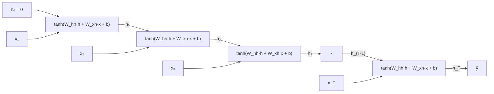
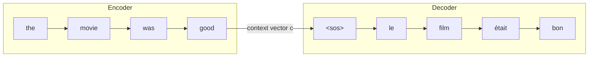

# 11 — Sequence models: RNNs, LSTMs, and the road to attention

Every network in this book so far has had a fixed-size input. The MLP of Module 03 took exactly 784 numbers; the convolutional network of Module 10 took exactly one 28×28 image. That constraint was invisible because MNIST obliges it, but most of the interesting data in the world does not. A sentence can be four words or four hundred. A stock price series has no natural end. A speech waveform, a protein, a log stream, a click trail — all of these are *sequences*, and their two defining properties are that the length varies and that the order carries meaning.

This module is where the running example shifts. MNIST has taught us what it can; from here the examples are sequential, and the concrete task we will keep returning to is deliberately tiny and synthetic: a model reads a string of tokens and must report something about the *first* token after being shown a long run of irrelevant noise. It sounds trivial, and for a human it is. It turns out to be the sharpest possible probe of the one thing that makes sequence modelling hard, and it will produce a result that contradicts the standard textbook story in a way worth understanding.

> **Prerequisite:** [Module 10](./10-convolutional-networks.md), and in particular the vanishing-gradient discussion from [Module 08](./08-initialization-and-normalization.md) — this module is that same problem in a new coordinate system.

## Why not just flatten the sequence?

The obvious move is to sidestep the problem: pad every sequence to a fixed length, concatenate the tokens, and feed the result to an MLP. This works, sometimes surprisingly well, and it is worth understanding exactly why it is unsatisfying, because the reasons prefigure everything else in the module.

The first objection is the one you can compute. If sequences can be up to 500 tokens and each token is a 300-dimensional embedding, the flattened input is 150,000 numbers and the first layer is back to the parameter blow-up that motivated convolution. Worse, the padding is wasted computation: a four-word sentence spends 99% of its forward pass multiplying zeros.

The second objection is the one that matters. A fully-connected layer learns a *different* weight for position 3 than for position 47. If the training set contains "the movie was terrible" starting at position 3 and the test set contains the same phrase starting at position 47, the model has learned nothing transferable. This is precisely the argument Module 10 made about images: an edge detector should not have to be relearned at every pixel location, and a negation detector should not have to be relearned at every sentence position. The property we want is the temporal analogue of translation equivariance, and the mechanism is the same one convolution used — **share the parameters across positions**.

Convolution over time is in fact a perfectly good answer, and modern architectures use it. But convolution has a fixed receptive field: a stack of $L$ layers with kernel size $k$ can only see $L(k-1)+1$ steps back. To handle a dependency of unbounded range you either keep stacking layers or you need a mechanism with unbounded memory. The recurrent neural network is the classical answer, and it is elegant enough that it dominated sequence modelling for twenty-five years.

## The recurrent neural network

The idea is to process the sequence one step at a time while carrying a *state* — a fixed-size vector that summarizes everything seen so far. At each step you combine the current input with the current state to produce a new state:

$$\mathbf{h}_t = \tanh\!\left(W_{hh}\,\mathbf{h}_{t-1} + W_{xh}\,\mathbf{x}_t + \mathbf{b}_h\right), \qquad \mathbf{h}_0 = \mathbf{0}$$

and optionally read an output off the state, $\mathbf{o}_t = W_{ho}\mathbf{h}_t + \mathbf{b}_o$.

Read that equation carefully, because almost everything about RNNs follows from its shape. There is exactly one $W_{hh}$, one $W_{xh}$, one $\mathbf{b}_h$ — the *same* parameters are applied at step 1 and at step 500. The parameter count is independent of sequence length, which is what lets a single trained model handle inputs it has never seen the length of. The state $\mathbf{h}_t$ is the only channel through which information from step 1 can reach step 500; it is a fixed-size bottleneck through which the entire past must pass. And the recurrence is genuinely *recursive*: $\mathbf{h}_t$ depends on $\mathbf{h}_{t-1}$ depends on $\mathbf{h}_{t-2}$, all the way down.

The cleanest way to see what this means for training is to **unroll** the recursion. An RNN run for $T$ steps is not a special kind of object; it is an ordinary feedforward network of depth $T$ in which every layer happens to share weights and every layer happens to receive a side input:



Once you see it as a deep feedforward network, everything from Module 05 applies unchanged. Backpropagation through the unrolled graph is called **backpropagation through time** (BPTT), but it is not a new algorithm — it is ordinary backprop on a graph that happens to reuse the same weight tensor $T$ times. The only wrinkle is the one Module 05 already covered for any shared parameter: because $W_{hh}$ appears at every step, its gradient is the *sum* of the contributions from all $T$ steps,

$$\frac{\partial \mathcal{L}}{\partial W_{hh}} = \sum_{t=1}^{T} \frac{\partial \mathcal{L}}{\partial \mathbf{h}_t}\Big|_{\text{via }W_{hh}\text{ at step }t}$$

and autograd does that summation for you automatically, because summing incoming gradients at a node is exactly what a reverse-mode accumulator does.

Here is the recurrence written out explicitly against PyTorch's `nn.RNN`, which is the best way to convince yourself there is no magic. The manual unroll reproduces the library output to within floating-point noise — a maximum absolute difference of $1.1\times10^{-16}$ across all timesteps:[^m11-unroll]

```python
import torch, torch.nn as nn

I, H, T, B = 3, 5, 7, 2
rnn = nn.RNN(I, H, batch_first=True)
x = torch.randn(B, T, I)
out, h_T = rnn(x)                       # library version

h, outs = torch.zeros(B, H), []          # manual unroll
for t in range(T):
    h = torch.tanh(x[:, t] @ rnn.weight_ih_l0.T + rnn.bias_ih_l0
                   + h      @ rnn.weight_hh_l0.T + rnn.bias_hh_l0)
    outs.append(h)
manual = torch.stack(outs, dim=1)

print((out - manual).abs().max())        # ~1e-16
```

Two PyTorch conventions are worth internalizing now because they recur in every sequence model you will write. `batch_first=True` gives tensors of shape `(batch, time, features)`, which is the layout most people find readable; the default is `(time, batch, features)`, which is faster for the underlying kernels and is what you will see in older code. And PyTorch carries *two* bias vectors, `bias_ih` and `bias_hh`, where the mathematics needs only one — they are redundant by construction (their sum is the only thing that matters) and exist to mirror the cuDNN kernel signature. When you set a bias by hand, as we will shortly, remember you are setting two of them.

For **variable-length** batches, padding to the longest sequence and then telling the RNN to ignore the padding is handled by `nn.utils.rnn.pack_padded_sequence`, which is worth knowing exists: without it, an RNN reading twenty pad tokens after a short sentence will let those pad tokens overwrite the state you cared about.

## The vanishing gradient, in time

Now for the problem. Consider how a gradient at the final step travels back to an early step. By the chain rule, the Jacobian of $\mathbf{h}_T$ with respect to $\mathbf{h}_1$ is a product of per-step Jacobians:

$$\frac{\partial \mathbf{h}_T}{\partial \mathbf{h}_1} = \prod_{t=2}^{T} \frac{\partial \mathbf{h}_t}{\partial \mathbf{h}_{t-1}} = \prod_{t=2}^{T} D_t\,W_{hh}, \qquad D_t = \operatorname{diag}\!\big(1 - \tanh^2(\mathbf{z}_t)\big)$$

That is the *same matrix* multiplied $T-1$ times, modulated by the tanh derivative. Module 08 established what happens when you multiply by a fixed matrix repeatedly: the result is governed by the spectral radius (the largest absolute eigenvalue) $\rho$ of that matrix, and $\|W^n\|$ grows or shrinks like $\rho^n$. Below one it collapses to zero; above one it explodes. There is no stable middle, because exponentials do not have one.

You can watch this happen in three lines. Take a random matrix, rescale it to a chosen spectral radius, and raise it to the 50th power:[^m11-spectral]

| spectral radius $\rho$ | $\lVert W^{50}\rVert$ |
| --- | --- |
| 0.9 | $5.9\times10^{-3}$ |
| 1.0 | $2.2$ |
| 1.1 | $2.1\times10^{2}$ |

A 10% change in the spectral radius moves the 50-step gradient by five orders of magnitude. And the tanh derivative makes it strictly worse: $1 - \tanh^2(z) \le 1$ always, with equality only at $z=0$, so $D_t$ can only ever shrink the product further. Vanishing is the default; exploding requires $W_{hh}$ to be large enough to overcome the saturation.

This is not a hypothetical. Measure the gradient of an untrained `nn.RNN`'s final output with respect to its *first* input and compare it to the gradient with respect to its *last* input:[^m11-graddecay]

| $T$ | RNN $\lVert\partial o_T/\partial \mathbf{x}_1\rVert$ | ratio to $\lVert\partial o_T/\partial \mathbf{x}_T\rVert$ | LSTM ratio |
| --- | --- | --- | --- |
| 10 | $4.0\times10^{-3}$ | $2.4\times10^{-3}$ | $4.6\times10^{-1}$ |
| 30 | $1.4\times10^{-8}$ | $8.5\times10^{-9}$ | $7.3\times10^{-1}$ |
| 60 | $1.6\times10^{-16}$ | $8.6\times10^{-17}$ | $3.6\times10^{-1}$ |

The RNN's sensitivity to its own first input falls by roughly eight orders of magnitude for every thirty timesteps, and by $T=60$ it is at the edge of float32 representability. The gradient signal telling the model "the answer depended on what you saw at step 1" is, numerically, gone. The LSTM column is flat, and the rest of this module explains why.

The two failure modes need different treatments and it is important not to confuse them. **Exploding gradients are easy**: the update is enormous, the loss spikes to `nan`, and the fix is gradient clipping — rescale the whole gradient vector whenever its norm exceeds a threshold, which preserves the direction while bounding the step.[^m11-pascanu]

```python
loss.backward()
torch.nn.utils.clip_grad_norm_(model.parameters(), max_norm=1.0)
optimizer.step()
```

Every recurrent training loop in this module uses it, and you should treat it as mandatory for RNNs rather than optional. **Vanishing gradients are hard**, because there is nothing to clip. Nothing goes wrong; nothing spikes; the loss simply plateaus at a level that corresponds to the model having learned only the short-range structure. It fails silently, which is the worst way for anything to fail. Rescaling a vector of $10^{-16}$s recovers no information — the signal is not attenuated, it is destroyed. Clipping cannot help, and the fix has to be architectural.

One more practical note before the architecture. For long or unbounded sequences you cannot backpropagate through all of history — the graph would not fit in memory. **Truncated BPTT** processes the sequence in chunks of, say, 128 steps, backpropagating within each chunk and passing the final hidden state forward to the next chunk *detached* from the graph (`h = h.detach()`). The forward pass therefore has unbounded memory while the backward pass has a bounded horizon. Forgetting the `detach()` is a classic bug: the graph grows without limit and you get either an out-of-memory error or a `RuntimeError` about backpropagating through a freed graph.

## Gating: the LSTM

The insight behind the Long Short-Term Memory network, published by Hochreiter and Schmidhuber in 1997, is that the problem is *multiplication*.[^m11-lstm] The state is repeatedly multiplied by a matrix, and repeated multiplication is exponential. If instead the state were repeatedly *added to*, the gradient path back through time would be a sum of identity maps and nothing would decay. This is the same structural insight that ResNet would rediscover for depth eighteen years later, which is why Module 10's residual block and the LSTM cell feel so similar once you see it.

So the LSTM introduces a second state vector, the **cell state** $\mathbf{c}_t$, whose default behaviour is to persist unchanged, and it controls all reads and writes to that cell with learned, data-dependent **gates**. A gate is nothing exotic — it is a vector in $(0,1)^H$ produced by a sigmoid layer and applied elementwise, so it is a soft, differentiable mask that says how much of each coordinate to let through.

$$
\begin{aligned}
\mathbf{f}_t &= \sigma\!\left(W_f[\mathbf{x}_t, \mathbf{h}_{t-1}] + \mathbf{b}_f\right) && \text{forget gate: what to keep} \\
\mathbf{i}_t &= \sigma\!\left(W_i[\mathbf{x}_t, \mathbf{h}_{t-1}] + \mathbf{b}_i\right) && \text{input gate: how much to write} \\
\mathbf{g}_t &= \tanh\!\left(W_g[\mathbf{x}_t, \mathbf{h}_{t-1}] + \mathbf{b}_g\right) && \text{candidate: what to write} \\
\mathbf{o}_t &= \sigma\!\left(W_o[\mathbf{x}_t, \mathbf{h}_{t-1}] + \mathbf{b}_o\right) && \text{output gate: what to expose} \\[4pt]
\mathbf{c}_t &= \mathbf{f}_t \odot \mathbf{c}_{t-1} + \mathbf{i}_t \odot \mathbf{g}_t && \text{cell update} \\
\mathbf{h}_t &= \mathbf{o}_t \odot \tanh(\mathbf{c}_t) && \text{hidden output}
\end{aligned}
$$

The cell update line is the whole design. If $\mathbf{f}_t = \mathbf{1}$ and $\mathbf{i}_t = \mathbf{0}$, then $\mathbf{c}_t = \mathbf{c}_{t-1}$ exactly, and the derivative $\partial \mathbf{c}_t/\partial \mathbf{c}_{t-1}$ is the identity. Chain a hundred of those together and the gradient arrives at step 1 undiminished. Hochreiter and Schmidhuber called this the **constant error carousel**, and it is the reason LSTMs work. Note also that the path is *elementwise*: coordinate 7 of the cell can hold something for 200 steps while coordinate 8 is overwritten every step, because the gates are vectors, not scalars. The network learns a per-coordinate, per-timestep retention policy.

The separation between $\mathbf{c}_t$ and $\mathbf{h}_t$ is the part people most often gloss over, so it is worth being precise. The cell is *storage*; the hidden state is a *view* of that storage, filtered by the output gate. This lets the network hold something it is not currently using — remembering that the subject of the sentence was plural, while emitting words that do not yet depend on it, and then opening the output gate when the verb arrives.

Written as code, and verified against `nn.LSTMCell` to a maximum difference of $1.1\times10^{-16}$:[^m11-cellcheck]

```python
gates = x @ W_ih.T + b_ih + h @ W_hh.T + b_hh   # PyTorch packs all four
i, f, g, o = gates.chunk(4, dim=1)              # gate order is [i, f, g, o]
i, f, g, o = i.sigmoid(), f.sigmoid(), g.tanh(), o.sigmoid()
c_next = f * c + i * g
h_next = o * torch.tanh(c_next)
```

That gate ordering — **input, forget, candidate, output** — is a PyTorch implementation detail, not a mathematical fact, but you need it whenever you touch LSTM parameters directly. We are about to.

The **GRU**, introduced by Cho et al. in 2014, is the same idea with fewer moving parts.[^m11-gru] It drops the separate cell state and couples the forget and input gates into a single **update gate** $\mathbf{z}_t$, so that whatever is not retained is exactly what is written:

$$\mathbf{h}_t = \mathbf{z}_t \odot \mathbf{h}_{t-1} + (1 - \mathbf{z}_t) \odot \tilde{\mathbf{h}}_t$$

with a **reset gate** $\mathbf{r}_t$ controlling how much of the previous state feeds the candidate $\tilde{\mathbf{h}}_t = \tanh(W_{n}\mathbf{x}_t + \mathbf{r}_t \odot (W_{hn}\mathbf{h}_{t-1} + \mathbf{b}_{hn}))$. Three gate-sized weight blocks instead of four, so roughly 25% fewer parameters and a correspondingly faster step. The empirical verdict after a decade is that GRUs and LSTMs perform comparably on most tasks, with neither dominating; the honest summary from the largest careful comparison is that the differences are smaller than the differences from tuning.[^m11-jozefowicz] PyTorch's GRU gate order is $[\mathbf{r}, \mathbf{z}, \mathbf{n}]$ — different from the LSTM's, another detail worth writing on your hand.

## A controlled experiment, and a surprise

Now the probe. Build sequences of length $T$ over a small vocabulary. Position 0 holds one of two *signal* tokens, which alone determines the label. Positions 1 through $T-1$ hold uniformly random *distractor* tokens carrying no information. The model reads the whole sequence and classifies from the final hidden state. Chance is 50%.

This isolates exactly one capability: carrying one bit across $T$ steps of noise. Every model gets the same embedding size, the same 32-unit hidden state, the same Adam learning rate, gradient clipping at norm 1.0, and the same seed. The only variable is the recurrent cell and the number of training steps. Here is what happens at $T=50$:[^m11-sweep]

| training steps | RNN | LSTM (default init) | LSTM (forget bias = 1) | GRU (default init) |
| --- | --- | --- | --- | --- |
| 250 | 48.9% | 50.7% | **100.0%** | 50.0% |
| 500 | 48.9% | 47.5% | **100.0%** | 50.3% |
| 1000 | 45.6% | 51.5% | **100.0%** | 50.9% |
| 2000 | 62.1% | 51.0% | **100.0%** | 51.2% |
| 4000 | **100.0%** | 48.1% | **100.0%** | 48.5% |

Look at that table for a moment before reading on, because two of its four columns say something you were probably not expecting.

The plain RNN, which the theory says cannot learn a 50-step dependency, *eventually does* — perfectly, at 4000 steps. And the LSTM, which the theory says should sail through, never leaves chance across the entire budget. If you had run only the 4000-step row you would have concluded that LSTMs are worse than RNNs, which is precisely backwards.

Take the RNN result first, because it is a genuine and instructive caveat on the vanishing-gradient story. The gradient measurement earlier was taken at *initialization*. It says the gradient is $10^{-16}$ for the randomly-initialized $W_{hh}$ — it does not say the gradient stays there. Training can move $W_{hh}$ toward a spectral radius near one, and once it does, the long-range path opens up. Adam helps enormously here because it normalizes by the gradient's own running magnitude (Module 06): a consistently tiny but consistently *signed* gradient still produces a full-sized Adam step, where SGD would produce a $10^{-16}$-sized one. So the accurate statement is not "RNNs cannot learn long dependencies" but "RNNs are enormously less *sample-efficient* at it, and are relying on a slow escape from a bad initialization." A 16× difference in training steps on a toy task becomes an untrainable model on a real one. Beware of any textbook claim you have not seen measured.

The LSTM result is the more actionable finding, and its cause is a single number. PyTorch initializes all RNN biases uniformly around zero, so at initialization the forget gate is $\sigma(0) = 0.5$. The cell state is therefore multiplied by about $0.5$ at every step, and $0.5^{50} \approx 10^{-15}$. The constant error carousel exists in the architecture, but it is *switched off by default* — the LSTM is initialized in a maximally forgetful configuration and must first learn to stop forgetting, which requires the very long-range gradient signal it cannot yet receive. It is a chicken-and-egg trap.

The fix, recommended by Gers et al. in 2000 and confirmed at scale by Jozefowicz et al. in 2015, is to initialize the forget-gate bias to a positive constant so the gate starts open:[^m11-forgetbias]

```python
lstm = nn.LSTM(input_size, H, batch_first=True)
for name, param in lstm.named_parameters():
    if "bias" in name:
        with torch.no_grad():
            param[H:2*H].fill_(1.0)     # slice [H:2H] is the forget gate
```

That one change takes the LSTM from 48% to 100% — and it gets there in 250 steps, sixteen times faster than the RNN ever does. The same reasoning applies to the GRU, where the analogous retention gate is the update gate $\mathbf{z}$ (also at slice `[H:2H]`, since the order is $[\mathbf{r},\mathbf{z},\mathbf{n}]$). Biasing it open likewise takes the GRU from 48.5% to 100% at 250 steps.[^m11-gruinit] The GRU column in the table is not evidence that GRUs are weak; it is the same initialization defect, and I have left it in the table precisely because that is how the failure would present itself to you in practice.

The general lesson outlives the LSTM. An architecture provides a *capability*; initialization determines whether the model starts anywhere near it. Module 10 made the identical point from the other direction, where zero-initializing the final BatchNorm $\gamma$ of a residual block starts the network at the identity function and lets depth-30 train as easily as depth-10. Skip connection and forget gate are the same trick, and both need to be initialized into the "pass through unchanged" state to pay off.

## Building with recurrence: depth, direction, and seq2seq

Three standard elaborations turn the cell into a usable architecture.

**Stacking** feeds the hidden-state sequence of one layer as the input sequence of the next, giving depth in the feature dimension on top of depth in time. `nn.LSTM(..., num_layers=2)` does this, and two or three layers is the usual sweet spot; beyond that the returns are small and you should add residual connections between layers if you go deeper.

**Bidirectionality** runs a second recurrence right-to-left and concatenates the two hidden states, so every position's representation sees the entire sequence.[^m11-bilstm] For classification and tagging this is nearly free accuracy — `bidirectional=True` — and the output width doubles to $2H$. For *generation* it is impossible, since the model would need to see the future it is trying to produce. That asymmetry is worth remembering because it is exactly the distinction that later separates BERT-style encoders from GPT-style decoders (Module 13).

**Sequence-to-sequence** is the architecture that made recurrent networks famous. Sutskever, Vinyals and Le showed in 2014 that you could train one RNN to read an English sentence into a fixed-size vector and a second RNN to generate a French sentence from that vector, end to end, with no linguistic machinery at all.[^m11-seq2seq]



Two training details matter. **Teacher forcing** feeds the decoder the *ground-truth* previous token during training rather than its own prediction, which makes training stable and parallel across decoder positions — at the cost of *exposure bias*, since at inference time the model must consume its own possibly-wrong outputs and has never practised recovering from its own mistakes. And **decoding** at inference is a search problem: greedy argmax at each step is fast but myopic, while **beam search** keeps the $k$ best partial sequences and typically buys a point or two of BLEU. Neither is a training-time concern, which is why they are easy to forget until your model produces fluent nonsense.

## The bottleneck, and why this module ends here

Look again at that diagram, at the single arrow between the encoder and the decoder. Everything the model knows about the source sentence must pass through that one fixed-size vector. For a five-word sentence that is comfortable. For a fifty-word sentence with subordinate clauses and long-distance agreement, you are asking a 512-dimensional vector to losslessly encode a paragraph — and the empirical signature is unmistakable: translation quality is flat for short sentences and then falls off a cliff as length grows, which is exactly what Cho et al. measured in 2014.[^m11-bottleneck]

There are really two problems, and they are worth separating because attention solves both.

The first is **capacity**: a fixed-size vector cannot hold an arbitrary-length input. The second is **path length**. To relate the first word to the fiftieth, information must traverse fifty sequential recurrent steps, and every one of those steps is an opportunity to attenuate or overwrite. Gating makes the attenuation *survivable* but it does not make the path *short*.

And there is a third problem, invisible in 1997 but decisive by 2017: recurrence is **inherently sequential**. Step $t$ cannot be computed until step $t-1$ is done, so an RNN cannot exploit a GPU's thousands of parallel cores along the time axis. As Module 14 will discuss under scaling laws, the architectures that won are the ones that could absorb more compute, and this single property doomed recurrence regardless of its modelling merits.

The resolution arrived in 2015 from Bahdanau, Cho and Bengio, and it is disarmingly simple.[^m11-bahdanau] Instead of forcing the decoder to work from one summary vector, keep *all* the encoder hidden states $\mathbf{h}_1, \dots, \mathbf{h}_T$, and let the decoder at each step compute a weighted average over them, with weights it chooses based on what it currently needs:

$$\mathbf{c}_i = \sum_{t=1}^{T} \alpha_{it}\,\mathbf{h}_t, \qquad \alpha_{it} = \operatorname{softmax}_t\!\big(\text{score}(\mathbf{s}_{i-1}, \mathbf{h}_t)\big)$$

The bottleneck is gone, because the context is now as large as the input. The path length is gone too, because the decoder reaches any encoder position in *one* step regardless of distance. And the attention weights $\alpha_{it}$ turned out to be interpretable: plot them as a heatmap and you see a soft word alignment emerge without ever having been supervised.

Bahdanau et al. bolted attention onto a recurrent model. The obvious next question — if attention gives you direct access to every position in one step, what is the recurrence still for? — took two more years to answer, and the answer was "nothing." That is Module 12.

## Before you move on

The through-line of this module is that recurrence buys you parameter sharing across time and unbounded memory, and charges you a product of Jacobians in return. Because that product is exponential in sequence length, it either vanishes or explodes, and only the exploding case is easy to fix. The LSTM's answer is to replace the multiplicative state update with an additive one guarded by learned gates, so that the default behaviour of the cell is to persist and the gradient has an identity path back through time — structurally the same idea as the residual connection, arrived at eighteen years earlier. But an architecture that *can* remember is not the same as one that *does*: with PyTorch's default zero-ish bias the forget gate starts half-closed and the carousel is switched off, which is why biasing that gate open turned chance-level performance into a perfect score sixteen times faster than a plain RNN could manage.

The experiment also left you with a healthy suspicion of tidy narratives. The plain RNN did eventually solve a 50-step dependency, so the vanishing-gradient argument is a statement about initialization and sample efficiency rather than an impossibility proof, and Adam's normalization is part of why. Hold on to the habit of checking the claim against a measurement.

If you can explain why the same $W_{hh}$ appearing at every timestep means its gradient is a sum rather than a single term, why gradient clipping helps with exploding but not vanishing gradients, what the cell state gives you that the hidden state does not, and why the encoder-decoder context vector is a bottleneck in two distinct ways — capacity and path length — then you have what you need. Do [Exercise Set 11](./exercises/11-exercises.md), which has you implement an LSTM cell from scratch, reproduce the forget-bias result, and watch a model fail on long sequences before you fix it. Then go to [Module 12](./12-attention-and-transformers.md), where removing the recurrence entirely turns out to cost nothing and buy everything.

## Sources

[^m11-unroll]: Measured: `nn.RNN(3, 5, batch_first=True)` in float64 against an explicit Python loop over 7 timesteps, batch 2. Maximum absolute difference $1.1\times10^{-16}$ on the full output sequence and $5.6\times10^{-17}$ on the final hidden state. Script in [`exercises/solutions/11-solutions.md`](./exercises/solutions/11-solutions.md).

[^m11-spectral]: Measured: random $5\times5$ Gaussian matrices rescaled so that $\max|\lambda_i| = \rho$, then raised to the 50th power; Frobenius norm reported. The rescaling makes the comparison exact rather than illustrative.

[^m11-graddecay]: Measured: untrained `nn.RNN(16, 32)` and `nn.LSTM(16, 32)` (forget bias 1), single backward pass from `out[:, -1].sum()`, gradient norms taken with respect to the first and last input embeddings. The RNN's ratio falls by roughly $10^{-8}$ per 30 steps; the LSTM's stays between 0.36 and 0.73 at all three lengths.

[^m11-pascanu]: Razvan Pascanu, Tomas Mikolov and Yoshua Bengio, ["On the difficulty of training Recurrent Neural Networks"](https://arxiv.org/abs/1211.5063), ICML 2013. Section 3 gives the spectral-radius analysis and Section 3.2 introduces norm clipping. The earlier analysis is Yoshua Bengio, Patrice Simard and Paolo Frasconi, ["Learning long-term dependencies with gradient descent is difficult"](https://www.researchgate.net/publication/5583935_Learning_long-term_dependencies_with_gradient_descent_is_difficult), IEEE Transactions on Neural Networks, 1994.

[^m11-lstm]: Sepp Hochreiter and Jürgen Schmidhuber, ["Long Short-Term Memory"](https://doi.org/10.1162/neco.1997.9.8.1735), Neural Computation 9(8), 1997. The forget gate is not in the original paper — it was added by Felix Gers, Jürgen Schmidhuber and Fred Cummins, ["Learning to Forget: Continual Prediction with LSTM"](https://doi.org/10.1162/089976600300015015), Neural Computation 12(10), 2000, and is now universally considered part of the architecture.

[^m11-cellcheck]: Measured: manual gate computation against `nn.LSTMCell(3, 4)` in float64, maximum absolute difference $1.1\times10^{-16}$ on the cell state and $1.0\times10^{-17}$ on the hidden state. The GRU equations were verified the same way against `nn.GRUCell`, also to $1.1\times10^{-16}$.

[^m11-gru]: Kyunghyun Cho et al., ["Learning Phrase Representations using RNN Encoder-Decoder for Statistical Machine Translation"](https://arxiv.org/abs/1406.1078), EMNLP 2014. The exact GRU formulation PyTorch implements is documented at [`nn.GRU`](https://pytorch.org/docs/stable/generated/torch.nn.GRU.html); note the reset gate is applied *inside* the candidate's hidden-state term, which differs from some presentations.

[^m11-jozefowicz]: Rafal Jozefowicz, Wojciech Zaremba and Ilya Sutskever, ["An Empirical Exploration of Recurrent Network Architectures"](https://proceedings.mlr.press/v37/jozefowicz15.html), ICML 2015 — an automated search over 10,000+ RNN variants that found none reliably better than the LSTM with a forget-bias of 1. See also Klaus Greff et al., ["LSTM: A Search Space Odyssey"](https://arxiv.org/abs/1503.04069), 2015, which ablates each LSTM component and finds the forget gate and output activation to be the critical ones.

[^m11-sweep]: Measured: vocabulary of 8 tokens, 16-dim embedding, 32-unit hidden state, single layer, classification head on the final hidden state, Adam at lr $3\times10^{-3}$, batch 64, gradient clipping at norm 1.0, identical seed for every cell. Test accuracy on 2,000 freshly generated sequences. Full script in [`exercises/solutions/11-solutions.md`](./exercises/solutions/11-solutions.md).

[^m11-forgetbias]: Gers et al. 2000 (above) recommend a positive forget bias; Jozefowicz et al. 2015 Section 4 states it explicitly as their single most valuable practical finding. PyTorch does not do this by default — see the long-running discussion at [pytorch/pytorch#750](https://github.com/pytorch/pytorch/issues/750) — so you must do it yourself.

[^m11-gruinit]: Measured with the same protocol: GRU with both bias vectors' update-gate slice `[H:2H]` filled with 1.0 reaches 100% at 250, 1000 and 4000 training steps, versus 50.0%, 50.9% and 48.5% with default initialization.

[^m11-bilstm]: Mike Schuster and Kuldip Paliwal, ["Bidirectional Recurrent Neural Networks"](https://doi.org/10.1109/78.650093), IEEE Transactions on Signal Processing, 1997; combined with LSTMs by Alex Graves and Jürgen Schmidhuber, ["Framewise phoneme classification with bidirectional LSTM"](https://doi.org/10.1016/j.neunet.2005.06.042), Neural Networks, 2005.

[^m11-seq2seq]: Ilya Sutskever, Oriol Vinyals and Quoc Le, ["Sequence to Sequence Learning with Neural Networks"](https://arxiv.org/abs/1409.3215), NeurIPS 2014. Their trick of *reversing* the source sentence — which shortens the path between the first source word and the first target word — is itself indirect evidence for the path-length problem attention would later solve.

[^m11-bottleneck]: Kyunghyun Cho, Bart van Merriënboer, Dzmitry Bahdanau and Yoshua Bengio, ["On the Properties of Neural Machine Translation: Encoder-Decoder Approaches"](https://arxiv.org/abs/1409.1259), 2014. Figure 2 is the length-versus-BLEU curve showing the degradation.

[^m11-bahdanau]: Dzmitry Bahdanau, Kyunghyun Cho and Yoshua Bengio, ["Neural Machine Translation by Jointly Learning to Align and Translate"](https://arxiv.org/abs/1409.0473), ICLR 2015. Figure 3 is the alignment heatmap.

**Further reading.** *Dive into Deep Learning* [Chapter 9](https://d2l.ai/chapter_recurrent-neural-networks/index.html) builds an RNN from scratch and then in the framework, and [Chapter 10](https://d2l.ai/chapter_recurrent-modern/index.html) covers LSTM, GRU, deep and bidirectional variants, and seq2seq with attention — the closest companion to this module. *Deep Learning* [Chapter 10](https://www.deeplearningbook.org/contents/rnn.html) is the rigorous treatment, especially Section 10.7 on long-term dependencies. Christopher Olah's ["Understanding LSTM Networks"](https://colah.github.io/posts/2015-08-Understanding-LSTMs/) remains the best diagrammatic explanation of the gates and is worth reading even after this module. Andrej Karpathy's ["The Unreasonable Effectiveness of Recurrent Neural Networks"](https://karpathy.github.io/2015/05/21/rnn-effectiveness/) is the piece that convinced a generation that character-level RNNs were interesting, and its samples are still fun. The [CS224n](https://web.stanford.edu/class/cs224n/) lecture notes on RNNs, vanishing gradients and machine translation cover this material with an NLP emphasis. For the PyTorch specifics, the [`nn.LSTM` documentation](https://pytorch.org/docs/stable/generated/torch.nn.LSTM.html) states the exact equations and parameter layout, and the [sequence models tutorial](https://pytorch.org/tutorials/beginner/nlp/sequence_models_tutorial.html) is a short hands-on introduction.
