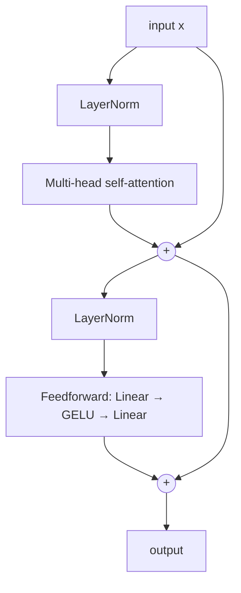

# 12 — Attention and Transformers

Module 11 ended with a question that took the field two years to answer. Bahdanau's attention gave a decoder direct, one-step access to every encoder position, dissolving both the capacity bottleneck and the path-length problem. But it was still bolted onto a recurrent backbone, and the recurrence was still there, still forcing every timestep to wait for its predecessor. In 2017 a team at Google Brain and Google Research asked what happens if you delete the recurrence and keep only the attention. The paper's title was the answer: *Attention Is All You Need*.[^m12-vaswani]

The result is the architecture that everything you have heard of is built on. GPT, BERT, T5, Llama, Claude, Stable Diffusion's text encoder, AlphaFold's Evoformer, Whisper, and the Vision Transformer that Module 10 mentioned as convolution's rival are all Transformers with different training objectives and different sizes. Understanding this module thoroughly is the difference between reading modern papers and watching them go by.

We will build the thing from the inside out: first the attention operation as a differentiable lookup table, then the scaling factor (and *why* it is $\sqrt{d_k}$, which we will derive and then measure), then multiple heads, then the position problem that dropping recurrence creates, then the block, then the three architectural families. The running example from Module 11 comes with us — the same 50-token task where a signal at position 0 must survive 49 steps of noise. The plain RNN needed 4,000 training steps to learn it and the well-initialized LSTM needed 250. A two-layer Transformer with 27,330 parameters learns it in **25**.[^m12-tinytf]

> **Prerequisite:** [Module 11](./11-sequence-models.md) — attention is the answer to the bottleneck that module ends on. You also want [Module 08](./08-initialization-and-normalization.md) fresh, because LayerNorm placement is a live design question here.

## Attention as a soft dictionary lookup

Strip away the terminology and attention is a familiar operation made differentiable.

A Python dictionary lookup takes a key you are looking for, compares it against the stored keys, finds the one that matches exactly, and returns the associated value. Written suggestively, `output = sum(value[k] for k in keys if k == query)` — a sum over all entries where the "match" is a hard 0/1 test. That test is not differentiable, so you cannot learn anything through it.

Attention replaces the equality test with a *similarity score* and the hard selection with a softmax. Every entry contributes; entries that match the query well contribute more. Given a **query** vector $\mathbf{q}$, a set of **key** vectors $\mathbf{k}_1,\dots,\mathbf{k}_n$ and their associated **value** vectors $\mathbf{v}_1,\dots,\mathbf{v}_n$:

$$\text{Attention}(\mathbf{q}, K, V) = \sum_{j=1}^{n} \alpha_j \mathbf{v}_j, \qquad \alpha_j = \frac{\exp(\mathbf{q}\cdot\mathbf{k}_j / \sqrt{d_k})}{\sum_{l}\exp(\mathbf{q}\cdot\mathbf{k}_l / \sqrt{d_k})}$$

The weights $\alpha_j$ are non-negative and sum to one, so the output is a *convex combination* of the values — a weighted average that lives in the same space the values do. If one score dominates, the output is essentially that one value and you have recovered a hard lookup. If the scores are all equal, the output is the mean of all values. Everything in between is available, and the whole thing is differentiable end to end, so the network can *learn what to look up*.

The dot product $\mathbf{q}\cdot\mathbf{k}_j$ is the similarity measure, and it is worth pausing on why it is a reasonable one. It is large when the two vectors point in the same direction and are long, zero when they are orthogonal, negative when they oppose. It costs one fused multiply-add per dimension and, crucially, computing *all* queries against *all* keys is a single matrix multiplication — the operation GPUs are built for. Bahdanau's original formulation used a small MLP to compute scores (*additive* attention), which is slightly more expressive and considerably slower; the dot product won on hardware grounds, which is a recurring theme in this field.

Batched over $n$ queries at once, the whole operation is two matmuls and a softmax:

$$\text{Attention}(Q, K, V) = \operatorname{softmax}\!\left(\frac{QK^\top}{\sqrt{d_k}}\right)V$$

with $Q \in \mathbb{R}^{n \times d_k}$, $K \in \mathbb{R}^{m \times d_k}$, $V \in \mathbb{R}^{m \times d_v}$. The matrix $QK^\top$ is $n\times m$ — every query scored against every key — and after the row-wise softmax each row is a probability distribution over the $m$ positions. That $n\times m$ matrix is the *attention matrix*, and it is both the source of the architecture's power and, at $O(n^2)$ memory, the source of its principal limitation.

In code it is four lines, and it matches PyTorch's fused `F.scaled_dot_product_attention` to $6.7\times10^{-16}$:[^m12-sdpa]

```python
import torch, math, torch.nn.functional as F

def attention(q, k, v, mask=None):
    scores = q @ k.transpose(-2, -1) / math.sqrt(q.size(-1))
    if mask is not None:
        scores = scores.masked_fill(~mask, float("-inf"))
    return scores.softmax(dim=-1) @ v
```

In practice, use `F.scaled_dot_product_attention` rather than your own: it dispatches to FlashAttention, which computes the same result without ever materializing the $n\times m$ matrix in high-bandwidth memory, and is both faster and dramatically more memory-efficient.[^m12-flash] Write the four lines once to understand it, then use the library.

## Self-attention: where Q, K and V come from

So far $Q$, $K$ and $V$ have been handed to us. The move that defines the Transformer is **self-attention**: derive all three from the *same* input sequence, by three learned linear projections.

Given input $X \in \mathbb{R}^{n\times d_{\text{model}}}$ — one row per token — set $Q = XW^Q$, $K = XW^K$, $V = XW^V$. Each token thus emits three different vectors playing three different roles. Its query says *what information am I looking for*; its key says *what information do I offer*; its value says *what I actually hand over if selected*. The output at position $i$ is a weighted mixture of every position's value, weighted by how well position $i$'s query matches each position's key.

Keeping these three roles distinct is what makes the mechanism work, and it is worth seeing why by imagining the degenerate alternative. If you set $Q = K = X$ with no projections, the score is $\mathbf{x}_i \cdot \mathbf{x}_j$, which is symmetric — position $i$ attends to $j$ exactly as much as $j$ attends to $i$ — and maximal on the diagonal, so every token mostly attends to itself. Neither property is what you want. Language is full of asymmetric relations: an adjective should attend to the noun it modifies far more than the noun attends back. Separate $W^Q$ and $W^K$ make the score matrix asymmetric and let the network place "what I seek" and "what I offer" in different regions of the space. Separating $V$ from $K$ is the same idea one level further: the feature that makes a token *findable* need not be the feature worth *retrieving*.

Now compare this to the recurrent alternative on the three axes that matter, which is Table 1 of the Vaswani paper and the most compressed argument for the architecture:

| | complexity per layer | sequential operations | max path length |
| --- | --- | --- | --- |
| self-attention | $O(n^2 \cdot d)$ | $O(1)$ | $O(1)$ |
| recurrent | $O(n \cdot d^2)$ | $O(n)$ | $O(n)$ |
| convolutional (kernel $k$) | $O(k \cdot n \cdot d^2)$ | $O(1)$ | $O(\log_k n)$ |

Read the middle and right columns together and the whole architecture makes sense. **Maximum path length** is how many operations a gradient must traverse to connect two arbitrary positions; for self-attention it is one, at any distance, so the vanishing-gradient-over-time problem of Module 11 simply does not arise. **Sequential operations** is what cannot be parallelized; for self-attention it is constant, so the entire sequence is processed in one batched matmul and a GPU's thousands of cores are all busy. Recurrence loses on both counts, and the loss on the second is what really killed it — an architecture that cannot absorb more compute cannot ride the hardware curve, a point Module 14 develops into scaling laws.

The left column is the price. Self-attention is *quadratic* in sequence length where recurrence is linear. For $n=512$ and $d=512$ the trade is favourable; for $n=100{,}000$ it is ruinous, which is why the context-length race is fundamentally a fight against that $n^2$.

## Why $\sqrt{d_k}$, and what happens without it

The scaling factor looks like an arbitrary implementation detail. It is not, and the derivation is short enough to do here.

Suppose the components of $\mathbf{q}$ and $\mathbf{k}$ are independent with mean 0 and variance 1 — which is roughly what a sensible initialization gives you (Module 08). Then their dot product $\mathbf{q}\cdot\mathbf{k} = \sum_{i=1}^{d_k} q_i k_i$ is a sum of $d_k$ independent terms, each with mean $\mathbb{E}[q_i k_i] = 0$ and variance $\mathbb{E}[q_i^2 k_i^2] = 1$. Variances of independent variables add, so

$$\operatorname{Var}(\mathbf{q}\cdot\mathbf{k}) = d_k, \qquad \text{standard deviation} = \sqrt{d_k}$$

The scores therefore grow like $\sqrt{d_k}$, and dividing by $\sqrt{d_k}$ restores unit variance regardless of head dimension. Measured over 20,000 random pairs, the variance tracks $d_k$ almost exactly and the scaled version sits at 1:[^m12-var]

| $d_k$ | $\operatorname{Var}(\mathbf{q}\cdot\mathbf{k})$ | $\operatorname{Var}(\mathbf{q}\cdot\mathbf{k}/\sqrt{d_k})$ |
| --- | --- | --- |
| 4 | 3.98 | 0.994 |
| 16 | 16.07 | 1.004 |
| 64 | 64.25 | 1.004 |
| 256 | 253.06 | 0.989 |

But *why does variance matter?* Because softmax is not scale-invariant — multiply all its inputs by a constant and the output distribution sharpens. Push the scale far enough and the softmax saturates: one weight goes to 1, the rest to 0, and the gradient through the softmax goes to zero along with them. This is the sigmoid saturation problem of Module 03 wearing a different hat.

Here is that failure measured directly. One query against 50 keys, with and without the scaling, reporting the largest attention weight, the entropy of the distribution (maximum $\ln 50 = 3.912$), and the norm of the gradient flowing back through the softmax:[^m12-sat]

| $d_k$ | | max weight | entropy | gradient norm |
| --- | --- | --- | --- | --- |
| 16 | unscaled | 0.607 | 1.584 | $2.6\times10^{-1}$ |
| 16 | scaled | 0.095 | 3.524 | $8.7\times10^{-2}$ |
| 64 | unscaled | 0.682 | 0.872 | $2.6\times10^{-1}$ |
| 64 | scaled | 0.119 | 3.372 | $1.1\times10^{-1}$ |
| 256 | unscaled | **0.9999** | **0.001** | $1.2\times10^{-4}$ |
| 256 | scaled | 0.112 | 3.476 | $1.0\times10^{-1}$ |

At $d_k = 256$ the unscaled attention has collapsed onto a single position *at initialization, before any learning*, with an entropy of 0.001 nats out of a possible 3.9, and the gradient is a thousand times smaller than the scaled version's. The network starts in a saturated regime and can barely move. This is exactly what Vaswani et al.'s footnote 4 says in one sentence, and now you have watched it happen. The general lesson is the Module 08 lesson again: the numerically fragile part of any architecture is usually a saturating nonlinearity, and the fix is usually a variance-preserving rescale in front of it.

## Multi-head attention

A single attention operation computes one weighted average, which means one set of weights, which means one notion of relevance per layer. But a token typically stands in several relations at once — a verb relates to its subject, its object, its tense marker and its clause. Averaging all of those into one distribution blurs them together.

Multi-head attention runs $h$ attention operations in parallel in *lower-dimensional subspaces* and concatenates the results:

$$\text{MultiHead}(X) = \left[\text{head}_1; \dots; \text{head}_h\right]W^O, \qquad \text{head}_i = \text{Attention}(XW_i^Q, XW_i^K, XW_i^V)$$

with each head projecting to $d_k = d_v = d_{\text{model}}/h$. Because the per-head dimension shrinks by exactly the factor by which the head count grows, the total parameter and FLOP cost is *the same* as one full-dimensional head — you get the multiplicity for free. The original paper used $d_{\text{model}} = 512$ with $h = 8$, so each head worked in 64 dimensions. That the heads specialize is not merely hoped-for: probing studies find heads that track syntactic dependencies, heads that attend to the previous token, heads that resolve coreference, and a large fraction that can be pruned with little loss.[^m12-heads]

Implementation is entirely a matter of reshaping. PyTorch packs $W^Q, W^K, W^V$ into a single `in_proj_weight` of shape $[3d_{\text{model}}, d_{\text{model}}]$ so that all three projections are one matmul, then splits the result into heads with a `view` and a `transpose`. The manual version below reproduces `nn.MultiheadAttention` to $1.1\times10^{-16}$:[^m12-mha]

```python
qkv = x @ mha.in_proj_weight.T + mha.in_proj_bias      # (B, T, 3E)
q, k, v = qkv.chunk(3, dim=-1)
split = lambda t: t.view(B, T, H, E // H).transpose(1, 2)   # (B, H, T, d)
q, k, v = split(q), split(k), split(v)

att = (q @ k.transpose(-2, -1) / math.sqrt(E // H)).softmax(-1) @ v
out = att.transpose(1, 2).reshape(B, T, E) @ mha.out_proj.weight.T + mha.out_proj.bias
```

The `transpose(1, 2)` that moves the head axis next to the batch axis is what lets the subsequent matmuls treat `(B, H)` as a single batch dimension, so all $B \times H$ attention operations run as one batched matmul. Everything after the projections is shape bookkeeping.

## The position problem

Now a consequence of dropping recurrence that is easy to miss and fatal if you do. Look at the attention formula again and ask what happens if you permute the input rows. The score matrix is permuted the same way, the softmax is row-wise, and the output is permuted identically. **Self-attention is permutation-equivariant** — it treats its input as a *set*, not a sequence. "Dog bites man" and "man bites dog" produce the same bag of representations.

An RNN never had this problem, because order was baked into the order of computation. Having thrown that away for parallelism, we must put position back in as *data*.

The original solution is a fixed **sinusoidal positional encoding** added to the input embeddings, using a different frequency for each embedding dimension:

$$PE_{(pos, 2i)} = \sin\!\left(\frac{pos}{10000^{2i/d}}\right), \qquad PE_{(pos, 2i+1)} = \cos\!\left(\frac{pos}{10000^{2i/d}}\right)$$

The wavelengths form a geometric progression from $2\pi$ to about $10000 \cdot 2\pi$, which is best understood as a *binary-clock analogue*: the fastest dimensions flip every couple of positions, the slowest barely change across the whole sequence, and reading all of them together identifies the position to high resolution. Two properties make the choice more than aesthetic. Every position's encoding has the same norm, so no position is systematically louder. And because $\sin(a+b)$ and $\cos(a+b)$ expand into linear combinations of $\sin a, \cos a, \sin b, \cos b$, the encoding of position $pos+k$ is a *fixed linear function* of the encoding of $pos$ — which means a linear projection like $W^Q$ can, in principle, learn to shift attention by a relative offset.

That relative structure shows up directly in the dot products. The inner product between two encodings depends only on their *offset*, not on their absolute positions, and it decays smoothly with distance:[^m12-pe]

| offset $k$ | $PE_{20}\cdot PE_{20+k}$ | $PE_{120}\cdot PE_{120+k}$ |
| --- | --- | --- |
| 0 | 32.000 | 32.000 |
| 1 | 30.917 | 30.917 |
| 2 | 28.304 | 28.304 |
| 5 | 23.504 | 23.504 |
| 10 | 21.052 | 21.052 |
| 50 | 15.674 | 15.674 |

Identical to three decimals in both columns — the encoding is translation-invariant in exactly the way an intuition about relative position would want.

Vaswani et al. also tried *learned* absolute embeddings (a plain `nn.Embedding(max_len, d_model)`) and found nearly identical results; BERT and GPT-2 use learned ones. The modern default has moved on again to **rotary position embeddings** (RoPE), which encode position by *rotating* the query and key vectors by an angle proportional to position, so the dot product depends on relative position by construction rather than by learned approximation.[^m12-rope] Llama, Mistral, Qwen and most current open models use RoPE. The evolution is a nice illustration of a general pattern: a hand-designed inductive bias, then a learned version, then a version that builds the bias into the operation's algebra.

## Masking

Attention as defined looks at everything. Two situations require it not to, and both are implemented by adding $-\infty$ to scores before the softmax, so that $e^{-\infty} = 0$ and those positions receive exactly zero weight.

**Padding masks** hide the pad tokens that make a ragged batch rectangular. Without one, real tokens attend to padding and pick up noise that varies with how long the *other* sequences in the batch happen to be — a bug that produces mysteriously batch-dependent results.

**Causal masks** are the interesting ones. When training a model to predict the next token, position $i$ must not see positions $> i$, or the task is trivially solvable by copying the answer. The mask is lower-triangular, and this single detail is what makes GPT-style training so efficient: with it, a sequence of $n$ tokens yields $n$ next-token prediction problems *in one forward pass*, all supervised, all computed in parallel. Without it you would need $n$ separate passes. The causal mask is the reason language-model pretraining scales.

```python
mask = torch.tril(torch.ones(T, T, dtype=torch.bool))   # True = may attend
scores = scores.masked_fill(~mask, float("-inf"))
```

Verified against `F.scaled_dot_product_attention(..., is_causal=True)` to $4.4\times10^{-16}$. Note the classic bug: masking *after* the softmax and renormalizing is not the same thing and will leak a little information from the future; always mask the scores.

## The Transformer block

We now have every ingredient. A Transformer block is multi-head self-attention followed by a position-wise feedforward network, each wrapped in a residual connection and a LayerNorm.



The **feedforward network** is an MLP applied independently and identically to every position: $\text{FFN}(\mathbf{x}) = W_2\,\phi(W_1\mathbf{x} + \mathbf{b}_1) + \mathbf{b}_2$, with a hidden width of $4d_{\text{model}}$ by near-universal convention. The division of labour is clean and worth stating explicitly: **attention moves information between positions; the feedforward network processes it within a position**. Attention is, per position, a linear operation on the values — all of the elementwise nonlinearity lives in the FFN. And despite receiving far less attention in expositions, the FFN holds roughly two-thirds of the parameters in a standard block, with growing evidence that it functions as the model's key-value memory of factual associations.[^m12-ffn] The original used ReLU; GELU is now standard, and gated variants (SwiGLU) are standard in current large models.[^m12-gelu]

The **residual connections** are the same device as Module 10's ResNet, doing the same job: they create an identity path from input to output, so gradients reach early layers undiminished and depth is close to free. It is not a coincidence that the Transformer arrived eighteen months after ResNet; hardly any deep architecture since 2015 lacks skip connections.

The **LayerNorm placement** is the one genuinely contested design decision, and Module 08 set it up. The original paper used **post-norm** — `x + Sublayer(x)` then normalize — which puts a normalization *on* the residual path and therefore breaks the clean identity, requiring a learning-rate warmup of several thousand steps to train at all. **Pre-norm** — `x + Sublayer(LayerNorm(x))` — normalizes only the branch, leaves the residual path completely clean, and trains without warmup and at higher learning rates.[^m12-prenorm] Essentially every model since GPT-2 uses pre-norm, and it is what the diagram above shows and what `nn.TransformerEncoderLayer(..., norm_first=True)` gives you. If you are ever handed a Transformer that diverges in the first thousand steps, check this first.

Notice also *why* LayerNorm rather than BatchNorm. Module 08's argument applies with full force: batch statistics over variable-length padded sequences are ill-defined, and inference on a single sequence would need running statistics that never match. LayerNorm normalizes across the feature dimension of each token independently, so it is oblivious to batch size, sequence length and padding.

## Three families

The full architecture stacks these blocks, and three arrangements cover essentially all of modern practice.

The **encoder-decoder** of the original paper has a bidirectional encoder stack, a causally-masked decoder stack, and *cross-attention* layers in the decoder where queries come from the decoder and keys and values from the encoder output. This is Bahdanau's attention generalized, and it suits genuine sequence-transduction tasks: translation, summarization, speech recognition. T5 and Whisper are here.

The **encoder-only** family keeps just the bidirectional stack and trains it with a masked-language-modelling objective — corrupt 15% of tokens and predict them from both directions. Bidirectionality makes these strong at *understanding* (classification, retrieval, tagging) and structurally incapable of generation. BERT is the canonical example, and embedding models are its descendants.[^m12-bert]

The **decoder-only** family keeps just the causally-masked stack and trains it to predict the next token. It is the simplest of the three, it has won, and its dominance is worth understanding as an argument rather than a fashion: next-token prediction on raw text needs no labels, so the training set is the internet; the causal mask makes every token a training example in a single parallel pass; and the objective turns out to subsume the others, since any task expressible as text can be posed as a completion. GPT, Llama, Mistral and Claude are all this.[^m12-gpt]

Which brings us back to our toy task. A two-layer, four-head, 32-dimensional pre-norm Transformer encoder with 27,330 parameters solves the 50-step dependency in **25 training steps**, against 250 for a well-initialized LSTM and 4,000 for a plain RNN.[^m12-tinytf] It is not that the Transformer is cleverer; it is that for the Transformer the task is *not a long-range problem at all*. Position 0 is one attention hop from the output, exactly as position 49 is. The distance that defined the difficulty for a recurrent model does not exist in this architecture.

```python
layer = nn.TransformerEncoderLayer(d_model=32, nhead=4, dim_feedforward=128,
                                   batch_first=True, norm_first=True, dropout=0.0)
encoder = nn.TransformerEncoder(layer, num_layers=2)
```

## What it costs, and what is still open

Two honest caveats before you conclude that attention solves everything.

The $O(n^2)$ cost is real and unsolved in the general case. Doubling the context quadruples the attention compute and memory, which is why context length is the headline number in every model release and why an industry of approximations exists — sparse and local attention, linear-attention kernels, and the state-space models (Mamba and successors) that revive the recurrent idea with a parallelizable scan.[^m12-longcontext] FlashAttention is worth singling out because it does not approximate anything: it is an exact algorithm that reorders the computation to avoid writing the $n\times n$ matrix to memory, turning a memory-bound operation into a compute-bound one.

And attention weights are *not* explanations. The heatmaps are seductive and the early alignment plots were genuinely informative, but a substantial literature shows you can often find very different attention distributions that produce the same output, and that attention weights correlate poorly with gradient-based importance.[^m12-attnexplain] Treat them as a diagnostic worth looking at and a claim worth doubting.

## Before you move on

Attention is a differentiable dictionary lookup: score every key against your query, softmax the scores into weights, and return the weighted average of the values. Self-attention derives all three of query, key and value from the same sequence by separate learned projections — separate because the roles genuinely differ, and symmetric scores would be the wrong model of language. Because every position reaches every other in one hop and nothing waits for anything, self-attention has constant path length and constant sequential depth where recurrence had linear versions of both, and it pays for that with quadratic cost in sequence length.

The $\sqrt{d_k}$ is not decoration. Dot products of $d_k$-dimensional unit-variance vectors have variance $d_k$, and at $d_k = 256$ the unscaled softmax saturates to a maximum weight of 0.9999 with a gradient a thousand times too small, before training has started. Dropping recurrence also throws away order, which is why positional information has to be added back explicitly, and the residual-plus-LayerNorm wrapper — pre-norm, not the original post-norm — is what makes the stack deep and trainable.

If you can explain why $W^Q$ and $W^K$ must be different matrices, why multi-head attention costs the same as single-head, what the causal mask buys you at training time beyond correctness, and why the feedforward sublayer is where all the per-position nonlinearity lives, you have the architecture. Do [Exercise Set 12](./exercises/12-exercises.md), which has you build multi-head attention from scratch, verify it against `nn.MultiheadAttention`, reproduce the saturation table, and train a small character-level decoder-only model. Then [Module 13](./13-transfer-learning-and-embeddings.md) takes up the question this module makes urgent: nobody trains these from scratch, so how do you use one someone else trained?

## Sources

[^m12-vaswani]: Ashish Vaswani et al., ["Attention Is All You Need"](https://arxiv.org/abs/1706.03762), NeurIPS 2017. Section 3.2 is the attention mechanism, Table 1 the complexity comparison, footnote 4 the $\sqrt{d_k}$ justification, Section 3.5 positional encoding. The reference implementation is [Tensor2Tensor](https://github.com/tensorflow/tensor2tensor).

[^m12-tinytf]: Measured: `nn.TransformerEncoder` of 2 pre-norm layers, $d_{\text{model}}=32$, 4 heads, FFN width 128, dropout 0, learned positional embedding, mean-pooled classification head; 27,330 parameters; Adam lr $3\times10^{-3}$, batch 64, gradient clipping 1.0, same seed and same data generator as [Module 11](./11-sequence-models.md). Reaches 100% on 2,000 held-out sequences at 25, 50, 75, 100, 250 and 1,000 training steps. Script in [`exercises/solutions/12-solutions.md`](./exercises/solutions/12-solutions.md).

[^m12-sdpa]: Measured in float64 with shapes $(2,4,6,8)$: maximum absolute difference $6.7\times10^{-16}$ unmasked and $4.4\times10^{-16}$ with `is_causal=True`.

[^m12-flash]: Tri Dao et al., ["FlashAttention: Fast and Memory-Efficient Exact Attention with IO-Awareness"](https://arxiv.org/abs/2205.14135), NeurIPS 2022, and [FlashAttention-2](https://arxiv.org/abs/2307.08691), 2023. PyTorch dispatches to it automatically through [`F.scaled_dot_product_attention`](https://pytorch.org/docs/stable/generated/torch.nn.functional.scaled_dot_product_attention.html) when the inputs qualify.

[^m12-var]: Measured: 20,000 independent pairs of $\mathcal{N}(0,1)$ vectors at each $d_k$; sample variance of the dot product and of the dot product divided by $\sqrt{d_k}$.

[^m12-sat]: Measured: one $\mathcal{N}(0,1)$ query against 50 $\mathcal{N}(0,1)$ keys, fixed seed, comparing $\mathbf{q}K^\top$ against $\mathbf{q}K^\top/\sqrt{d_k}$. Gradient norm is $\lVert\partial(\max_j \alpha_j)/\partial\text{scores}\rVert$, a proxy for how much signal reaches the projections.

[^m12-heads]: Kevin Clark et al., ["What Does BERT Look At? An Analysis of BERT's Attention"](https://arxiv.org/abs/1906.04341), 2019, finds heads specialized for direct objects, determiners and coreference. Paul Michel, Omer Levy and Graham Neubig, ["Are Sixteen Heads Really Better than One?"](https://arxiv.org/abs/1905.10650), NeurIPS 2019, prunes most heads at test time with little loss — the redundancy appears to matter during *training*.

[^m12-mha]: Measured in float64 against `nn.MultiheadAttention(embed_dim=8, num_heads=4, batch_first=True)`: maximum absolute difference $1.1\times10^{-16}$. Note PyTorch's `in_proj_weight` stacks $[W^Q; W^K; W^V]$ in that order.

[^m12-pe]: Measured: sinusoidal encoding at $d=64$, base 10000, sequence length 200. All rows have norm $\sqrt{d/2} = 5.657$. Dot products at offsets $k$ from base positions 20 and 120 agree to all printed digits.

[^m12-rope]: Jianlin Su et al., ["RoFormer: Enhanced Transformer with Rotary Position Embedding"](https://arxiv.org/abs/2104.09864), 2021. See also Peter Shaw, Jakob Uszkoreit and Ashish Vaswani, ["Self-Attention with Relative Position Representations"](https://arxiv.org/abs/1803.02155), NAACL 2018, and Ofir Press et al., ["Train Short, Test Long: Attention with Linear Biases (ALiBi)"](https://arxiv.org/abs/2108.12409), ICLR 2022.

[^m12-ffn]: Mor Geva et al., ["Transformer Feed-Forward Layers Are Key-Value Memories"](https://arxiv.org/abs/2012.14913), EMNLP 2021. Parameter arithmetic: attention contributes $4d^2$ per block (Q, K, V, O) and the FFN $8d^2$ (up and down at width $4d$), so the FFN is two-thirds of the block.

[^m12-gelu]: Dan Hendrycks and Kevin Gimpel, ["Gaussian Error Linear Units (GELUs)"](https://arxiv.org/abs/1606.08415), 2016; Noam Shazeer, ["GLU Variants Improve Transformer"](https://arxiv.org/abs/2002.05202), 2020, which introduced SwiGLU.

[^m12-prenorm]: Ruibin Xiong et al., ["On Layer Normalization in the Transformer Architecture"](https://arxiv.org/abs/2002.04745), ICML 2020 — shows post-norm has gradients at initialization that scale badly with depth and that pre-norm removes the need for warmup. Jimmy Lei Ba, Jamie Kiros and Geoffrey Hinton, ["Layer Normalization"](https://arxiv.org/abs/1607.06450), 2016, is the original.

[^m12-bert]: Jacob Devlin et al., ["BERT: Pre-training of Deep Bidirectional Transformers for Language Understanding"](https://arxiv.org/abs/1810.04805), NAACL 2019.

[^m12-gpt]: Alec Radford et al., ["Improving Language Understanding by Generative Pre-Training"](https://cdn.openai.com/research-covers/language-unsupervised/language_understanding_paper.pdf), 2018, and ["Language Models are Unsupervised Multitask Learners"](https://cdn.openai.com/better-language-models/language_models_are_unsupervised_multitask_learners.pdf) (GPT-2), 2019. Tom Brown et al., ["Language Models are Few-Shot Learners"](https://arxiv.org/abs/2005.14165) (GPT-3), NeurIPS 2020.

[^m12-longcontext]: Yi Tay et al., ["Efficient Transformers: A Survey"](https://arxiv.org/abs/2009.06732), 2020, catalogues the approximation landscape. Albert Gu and Tri Dao, ["Mamba: Linear-Time Sequence Modeling with Selective State Spaces"](https://arxiv.org/abs/2312.00752), 2023, is the leading state-space alternative.

[^m12-attnexplain]: Sarthak Jain and Byron Wallace, ["Attention is not Explanation"](https://arxiv.org/abs/1902.10186), NAACL 2019; Sarah Wiegreffe and Yuval Pinter, ["Attention is not not Explanation"](https://arxiv.org/abs/1908.04626), EMNLP 2019, is the rebuttal. Reading both is the honest position.

**Further reading.** Start with Jay Alammar's ["The Illustrated Transformer"](https://jalammar.github.io/illustrated-transformer/) if any of the tensor shapes felt slippery — it is the best visual walkthrough available. Then read Andrej Karpathy's ["Let's build GPT: from scratch, in code, spelled out"](https://www.youtube.com/watch?v=kCc8FmEb1nY) and the accompanying [nanoGPT](https://github.com/karpathy/nanoGPT), which is the single most valuable few hundred lines of code you can read on this topic. ["The Annotated Transformer"](https://nlp.seas.harvard.edu/annotated-transformer/) from Harvard NLP walks the original paper line by line with runnable code. *Dive into Deep Learning* [Chapter 11](https://d2l.ai/chapter_attention-mechanisms-and-transformers/index.html) builds attention from Nadaraya-Watson kernel regression, which is a genuinely illuminating angle, then covers the full architecture and Vision Transformers. The [CS224n](https://web.stanford.edu/class/cs224n/) lectures on self-attention and Transformers are the best lecture treatment. For PyTorch specifics, see [`nn.MultiheadAttention`](https://pytorch.org/docs/stable/generated/torch.nn.MultiheadAttention.html), [`nn.TransformerEncoderLayer`](https://pytorch.org/docs/stable/generated/torch.nn.TransformerEncoderLayer.html) and the [transformer building blocks tutorial](https://pytorch.org/tutorials/intermediate/transformer_building_blocks.html).
